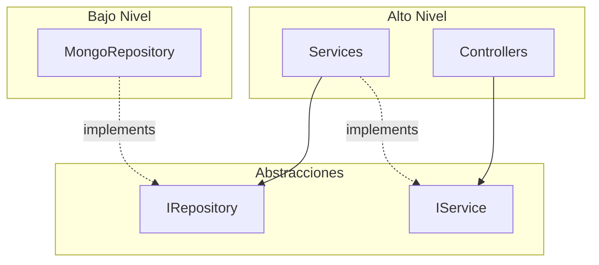
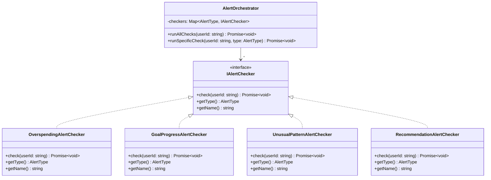
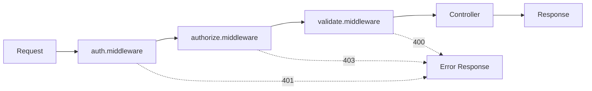

# Principios SOLID y Patrones de Diseño - MonetixBackend

Este documento detalla la implementación de los principios SOLID y patrones de diseño utilizados en el proyecto MonetixBackend.

---

## 📋 Tabla de Contenidos

1. [Principios SOLID](#principios-solid)
   - [Single Responsibility Principle (SRP)](#1-single-responsibility-principle-srp)
   - [Open/Closed Principle (OCP)](#2-openclosed-principle-ocp)
   - [Liskov Substitution Principle (LSP)](#3-liskov-substitution-principle-lsp)
   - [Interface Segregation Principle (ISP)](#4-interface-segregation-principle-isp)
   - [Dependency Inversion Principle (DIP)](#5-dependency-inversion-principle-dip)
2. [Patrones de Diseño](#patrones-de-diseño)
   - [Repository Pattern](#1-repository-pattern)
   - [Strategy Pattern](#2-strategy-pattern)
   - [Dependency Injection](#3-dependency-injection)
   - [DTO Pattern](#4-dto-pattern-data-transfer-object)
   - [Chain of Responsibility](#5-chain-of-responsibility-middleware-pattern)
   - [Singleton Pattern](#6-singleton-pattern)
   - [Layered Architecture](#7-layered-architecture)

---

## Principios SOLID

### 1. Single Responsibility Principle (SRP)

> *"Una clase debe tener una única razón para cambiar"*

#### Implementación:

La arquitectura separa claramente las responsabilidades:

| Capa | Responsabilidad | Ejemplo |
|------|-----------------|---------|
| **Controllers** | Manejo de HTTP requests/responses | `TransactionController` |
| **Services** | Lógica de negocio | `TransactionService` |
| **Repositories** | Acceso a datos | `MongoTransactionRepository` |
| **Validators** | Validación de datos | `transaction.validator.ts` |
| **Middlewares** | Autenticación/Autorización | `auth.middleware.ts` |

#### Ejemplo - TransactionController:

```typescript
// src/controllers/transaction.controller.ts
@injectable()
export class TransactionController {
  constructor(
    @inject(Symbol.for('ITransactionService')) private transactionService: ITransactionService,
    @inject(Symbol.for('ITransactionAnalyticsService')) private analyticsService: ITransactionAnalyticsService
  ) {}

  // Solo se encarga de:
  // 1. Extraer datos del request
  // 2. Delegar al servicio
  // 3. Formatear la respuesta
  async createTransaction(request: Request, response: Response): Promise<Response> {
    const userId = request.user?.id!;
    const { categoryId, amount, type, description, date } = request.body;

    const transaction = await this.transactionService.createTransaction(userId, {
      categoryId, amount, type, description, date
    });

    return response.status(201).json({
      success: true,
      message: 'Transacción creada exitosamente',
      data: transaction,
    });
  }
}
```

---

### 2. Open/Closed Principle (OCP)

> *"Las entidades deben estar abiertas para extensión, pero cerradas para modificación"*

#### Implementación - Sistema de Alertas:

El sistema de alertas permite agregar nuevos tipos de checkers sin modificar el código existente.

```
src/core/alerts/
├── interfaces/
│   └── IAlertChecker.ts          ← Interfaz base
├── checkers/
│   ├── OverspendingAlertChecker.ts
│   ├── GoalProgressAlertChecker.ts
│   ├── UnusualPatternAlertChecker.ts
│   └── RecommendationAlertChecker.ts   ← Nuevos checkers se agregan aquí
└── AlertOrchestrator.ts          ← No requiere modificación
```

#### La interfaz `IAlertChecker`:

```typescript
// src/core/alerts/interfaces/IAlertChecker.ts
export type AlertType = 'overspending' | 'goal_progress' | 'unusual_pattern' | 'recommendation';

export interface IAlertChecker {
  check(userId: string): Promise<void>;
  getType(): AlertType;
  getName(): string;
}
```

#### Para agregar un nuevo checker:

1. Crear nueva clase implementando `IAlertChecker`
2. Registrar en el contenedor DI
3. **No se modifica** `AlertOrchestrator` ni otros checkers

```typescript
// Ejemplo: Nuevo checker
@injectable()
export class NewAlertChecker implements IAlertChecker {
  getType(): AlertType { return 'new_type'; }
  getName(): string { return 'New Alert Checker'; }
  async check(userId: string): Promise<void> { /* lógica */ }
}

// Registro en container.ts
container.bind<IAlertChecker>(Symbol.for('IAlertChecker')).to(NewAlertChecker);
```

---

### 3. Liskov Substitution Principle (LSP)

> *"Los objetos de una superclase deben poder ser reemplazados por objetos de sus subclases sin alterar el comportamiento"*

#### Implementación:

Todas las implementaciones de repositorios pueden sustituir sus interfaces:

```typescript
// Interfaz
export interface ITransactionRepository {
  findById(id: string): Promise<ITransaction | null>;
  create(data: CreateTransactionDTO): Promise<ITransaction>;
  update(id: string, userId: string, data: UpdateTransactionDTO): Promise<ITransaction | null>;
  delete(id: string, userId: string): Promise<boolean>;
  // ...
}

// Implementación MongoDB (actual)
@injectable()
export class MongoTransactionRepository implements ITransactionRepository {
  async findById(id: string): Promise<ITransaction | null> {
    return Transaction.findById(id).populate('categoryId').lean();
  }
  // ... resto de métodos
}

// Posible implementación PostgreSQL (futura)
@injectable()
export class PostgreSQLTransactionRepository implements ITransactionRepository {
  async findById(id: string): Promise<ITransaction | null> {
    // Misma firma, diferente implementación
    return db.query('SELECT * FROM transactions WHERE id = $1', [id]);
  }
  // ... resto de métodos
}
```

> [!TIP]
> Para cambiar de MongoDB a PostgreSQL, solo se necesita cambiar el binding en `container.ts`

---

### 4. Interface Segregation Principle (ISP)

> *"Los clientes no deben depender de interfaces que no utilizan"*

#### Implementación:

Las interfaces están segregadas por responsabilidad:

```
src/repositories/interfaces/
├── IAlertRepository.ts        (949 bytes)
├── ICategoryRepository.ts     (1008 bytes)
├── IGoalRepository.ts         (819 bytes)
└── ITransactionRepository.ts  (1396 bytes)

src/services/interfaces/
├── ICategoryService.ts              (859 bytes)
├── IGoalService.ts                  (638 bytes)
├── ITransactionAnalyticsService.ts  (406 bytes)
└── ITransactionService.ts           (832 bytes)
```

#### Ejemplo de interfaces específicas:

```typescript
// Solo métodos necesarios para analytics
export interface ITransactionAnalyticsService {
  getStatistics(userId: string): Promise<TransactionStats>;
  getByCategory(userId: string): Promise<CategoryAggregation[]>;
  getByPeriod(userId: string, period: 'day' | 'week' | 'month'): Promise<PeriodAggregation[]>;
}

// Separada de operaciones CRUD
export interface ITransactionService {
  getTransactions(userId: string, filter: TransactionFilter, pagination: PaginationOptions): Promise<PaginatedResult<ITransaction>>;
  getTransactionById(userId: string, id: string): Promise<ITransaction | null>;
  createTransaction(userId: string, data: Omit<CreateTransactionDTO, 'userId'>): Promise<ITransaction>;
  updateTransaction(userId: string, id: string, data: UpdateTransactionDTO): Promise<ITransaction | null>;
  deleteTransaction(userId: string, id: string): Promise<{ id: string; amount: number; type: string }>;
}
```

---

### 5. Dependency Inversion Principle (DIP)

> *"Los módulos de alto nivel no deben depender de módulos de bajo nivel. Ambos deben depender de abstracciones"*

#### Implementación:

Los servicios dependen de interfaces, no de implementaciones concretas:

```typescript
// src/services/TransactionService.ts
@injectable()
export class TransactionService implements ITransactionService {
  constructor(
    // Depende de INTERFACES, no de implementaciones
    @inject(TYPES.ITransactionRepository) private transactionRepo: ITransactionRepository,
    @inject(TYPES.ICategoryRepository) private categoryRepo: ICategoryRepository,
    @inject(TYPES.IGoalRepository) private goalRepo: IGoalRepository
  ) {}
}
```

#### Diagrama de dependencias:



---

## Patrones de Diseño

### 1. Repository Pattern

> Abstrae el acceso a datos proporcionando una interfaz de colección para acceder a objetos de dominio.

#### Estructura:

```
src/repositories/
├── interfaces/
│   ├── IAlertRepository.ts
│   ├── ICategoryRepository.ts
│   ├── IGoalRepository.ts
│   └── ITransactionRepository.ts
├── MongoAlertRepository.ts
├── MongoCategoryRepository.ts
├── MongoGoalRepository.ts
└── MongoTransactionRepository.ts
```

#### Implementación:

```typescript
// Interfaz del repositorio
export interface ITransactionRepository {
  findById(id: string): Promise<ITransaction | null>;
  findByUser(userId: string, filter?: TransactionFilter): Promise<ITransaction[]>;
  findByCategory(categoryId: string): Promise<ITransaction[]>;
  findByDateRange(userId: string, from: Date, to: Date): Promise<ITransaction[]>;
  create(data: CreateTransactionDTO): Promise<ITransaction>;
  update(id: string, userId: string, data: UpdateTransactionDTO): Promise<ITransaction | null>;
  delete(id: string, userId: string): Promise<boolean>;
  countByUser(userId: string, filter?: TransactionFilter): Promise<number>;
  sumByType(userId: string, type: 'income' | 'expense'): Promise<number>;
  findWithPagination(userId: string, filter: TransactionFilter, pagination: PaginationOptions): Promise<PaginatedResult<ITransaction>>;
  aggregateByCategory(userId: string): Promise<CategoryAggregation[]>;
  aggregateByPeriod(userId: string, period: 'day' | 'week' | 'month'): Promise<PeriodAggregation[]>;
}

// Implementación MongoDB
@injectable()
export class MongoTransactionRepository implements ITransactionRepository {
  async findById(id: string): Promise<ITransaction | null> {
    if (!mongoose.Types.ObjectId.isValid(id)) {
      return null;
    }
    return Transaction.findById(id)
      .populate('categoryId', 'name type icon color')
      .lean() as unknown as ITransaction | null;
  }

  async create(data: CreateTransactionDTO): Promise<ITransaction> {
    const transaction = new Transaction({
      userId: data.userId,
      categoryId: data.categoryId,
      amount: data.amount,
      type: data.type,
      description: data.description,
      date: data.date || new Date(),
    });
    await transaction.save();
    return Transaction.findById(transaction._id)
      .populate('categoryId', 'name type icon color')
      .lean() as unknown as ITransaction;
  }
  // ... más métodos
}
```

#### Beneficios:
- ✅ Desacopla la lógica de negocio del acceso a datos
- ✅ Facilita cambiar de base de datos (MongoDB → PostgreSQL)
- ✅ Permite pruebas unitarias con mocks
- ✅ Centraliza consultas complejas

---

### 2. Strategy Pattern

> Define una familia de algoritmos, encapsula cada uno y los hace intercambiables.

#### Implementación en Sistema de Alertas:

```typescript
// Interfaz Strategy
export interface IAlertChecker {
  check(userId: string): Promise<void>;
  getType(): AlertType;
  getName(): string;
}

// Contexto
@injectable()
export class AlertOrchestrator {
  private checkers: Map<AlertType, IAlertChecker>;

  constructor(@multiInject(Symbol.for('IAlertChecker')) checkers: IAlertChecker[]) {
    this.checkers = new Map();
    checkers.forEach((checker) => {
      this.checkers.set(checker.getType(), checker);
    });
  }

  async runAllChecks(userId: string): Promise<void> {
    const checkPromises = Array.from(this.checkers.values()).map((checker) =>
      checker.check(userId).catch((error) => {
        console.error(`Error en ${checker.getName()}:`, error);
      })
    );
    await Promise.all(checkPromises);
  }

  async runSpecificCheck(userId: string, type: AlertType): Promise<void> {
    const checker = this.checkers.get(type);
    if (!checker) {
      throw new Error(`No existe checker para el tipo: ${type}`);
    }
    await checker.check(userId);
  }
}
```

#### Estrategias Concretas:

| Checker | Responsabilidad |
|---------|-----------------|
| `OverspendingAlertChecker` | Detecta gastos excesivos |
| `GoalProgressAlertChecker` | Monitorea progreso de metas |
| `UnusualPatternAlertChecker` | Identifica patrones inusuales |
| `RecommendationAlertChecker` | Genera recomendaciones |

#### Diagrama:



---

### 3. Dependency Injection

> Técnica donde los objetos reciben sus dependencias en lugar de crearlas.

#### Implementación con InversifyJS:

```typescript
// src/config/container.ts
import { Container } from 'inversify';

const container = new Container();

// ========== REPOSITORIES ==========
container.bind<ITransactionRepository>(TYPES.ITransactionRepository)
  .to(MongoTransactionRepository)
  .inSingletonScope();

container.bind<ICategoryRepository>(Symbol.for('ICategoryRepository'))
  .to(MongoCategoryRepository)
  .inSingletonScope();

container.bind<IGoalRepository>(Symbol.for('IGoalRepository'))
  .to(MongoGoalRepository)
  .inSingletonScope();

container.bind<IAlertRepository>(Symbol.for('IAlertRepository'))
  .to(MongoAlertRepository)
  .inSingletonScope();

// ========== SERVICES ==========
container.bind<ITransactionService>(Symbol.for('ITransactionService'))
  .to(TransactionService)
  .inSingletonScope();

container.bind<ITransactionAnalyticsService>(Symbol.for('ITransactionAnalyticsService'))
  .to(TransactionAnalyticsService)
  .inSingletonScope();

// ========== ALERT CHECKERS ==========
container.bind<IAlertChecker>(Symbol.for('IAlertChecker'))
  .to(OverspendingAlertChecker);
container.bind<IAlertChecker>(Symbol.for('IAlertChecker'))
  .to(GoalProgressAlertChecker);
container.bind<IAlertChecker>(Symbol.for('IAlertChecker'))
  .to(UnusualPatternAlertChecker);
container.bind<IAlertChecker>(Symbol.for('IAlertChecker'))
  .to(RecommendationAlertChecker);

// ========== ALERT ORCHESTRATOR ==========
container.bind<AlertOrchestrator>(Symbol.for('AlertOrchestrator'))
  .to(AlertOrchestrator)
  .inSingletonScope();

export { container };
```

#### Uso en clases:

```typescript
@injectable()
export class TransactionService implements ITransactionService {
  constructor(
    @inject(TYPES.ITransactionRepository) private transactionRepo: ITransactionRepository,
    @inject(TYPES.ICategoryRepository) private categoryRepo: ICategoryRepository,
    @inject(TYPES.IGoalRepository) private goalRepo: IGoalRepository
  ) {}
}
```

#### Beneficios:
- ✅ Bajo acoplamiento entre componentes
- ✅ Facilita testing con mocks
- ✅ Configuración centralizada
- ✅ Gestión de ciclo de vida (singleton, transient)

---

### 4. DTO Pattern (Data Transfer Object)

> Objetos que transportan datos entre capas de la aplicación.

#### Estructura:

```
src/dtos/
├── category.dto.ts
├── goal.dto.ts
├── transaction.dto.ts
└── user.dto.ts
```

#### Ejemplo:

```typescript
// src/dtos/transaction.dto.ts

// DTO para crear transacción
export interface CreateTransactionDTO {
  userId: string;
  categoryId: string;
  amount: number;
  type: 'income' | 'expense';
  description?: string;
  date?: Date;
}

// DTO para actualizar transacción
export interface UpdateTransactionDTO {
  categoryId?: string;
  amount?: number;
  type?: 'income' | 'expense';
  description?: string;
  date?: Date;
}

// DTO para filtros
export interface TransactionFilter {
  type?: 'income' | 'expense';
  categoryId?: string;
  dateRange?: { from?: Date; to?: Date };
  amountRange?: { min?: number; max?: number };
}

// DTO para paginación
export interface PaginationOptions {
  page: number;
  limit: number;
  sortBy: string;
  sortOrder: 'asc' | 'desc';
}

// DTO para resultados paginados
export interface PaginatedResult<T> {
  data: T[];
  pagination: {
    page: number;
    limit: number;
    total: number;
    pages: number;
  };
}
```

#### Beneficios:
- ✅ Define contratos claros entre capas
- ✅ Evita exponer entidades de dominio
- ✅ Facilita validación de datos
- ✅ Independencia entre capas

---

### 5. Chain of Responsibility (Middleware Pattern)

> Permite pasar solicitudes a lo largo de una cadena de handlers.

#### Estructura de Middlewares:

```
src/middlewares/
├── auth.middleware.ts        → Autenticación
├── admin.middleware.ts       → Verificación de admin
├── authorize.middleware.ts   → Autorización por roles
└── validate.middleware.ts    → Validación de datos
```

#### Implementación:

```typescript
// src/middlewares/auth.middleware.ts
export const authenticate = async (
  req: Request,
  res: Response,
  next: NextFunction
): Promise<void> => {
  try {
    const authHeader = req.headers.authorization;

    if (!authHeader || !authHeader.startsWith('Bearer ')) {
      res.status(401).json({
        success: false,
        message: 'Token no proporcionado',
      });
      return;
    }

    const token = authHeader.split(' ')[1];
    const decoded = jwt.verify(token, getJwtSecret()) as JwtPayload;
    const user = await User.findById(decoded.userId).select('-password');

    if (!user) {
      res.status(401).json({
        success: false,
        message: 'Usuario no encontrado',
      });
      return;
    }

    req.user = user;
    next(); // Continúa la cadena
  } catch (error) {
    res.status(401).json({
      success: false,
      message: 'Token inválido o expirado',
    });
  }
};
```

#### Flujo de la Cadena:



#### Uso en rutas:

```typescript
router.post('/transactions',
  authenticate,           // Primero autentica
  validate(transactionSchema), // Luego valida
  transactionController.createTransaction // Finalmente ejecuta
);
```

---

### 6. Singleton Pattern

> Garantiza que una clase tenga una única instancia y proporciona acceso global.

#### Implementación con InversifyJS:

```typescript
// Configuración singleton en container.ts
container.bind<ITransactionRepository>(TYPES.ITransactionRepository)
  .to(MongoTransactionRepository)
  .inSingletonScope();  // ← Singleton

container.bind<ICategoryService>(Symbol.for('ICategoryService'))
  .to(CategoryService)
  .inSingletonScope();  // ← Singleton
```

#### Beneficios:
- ✅ Una sola conexión a base de datos por repositorio
- ✅ Estado compartido cuando es necesario
- ✅ Eficiencia de recursos

---

### 7. Layered Architecture

> Organiza el código en capas con responsabilidades específicas.

#### Capas del Sistema:

```
┌─────────────────────────────────────────────┐
│              PRESENTATION LAYER              │
│  (Controllers, Routes, Middlewares)          │
├─────────────────────────────────────────────┤
│              BUSINESS LAYER                  │
│  (Services, DTOs, Validators)                │
├─────────────────────────────────────────────┤
│              DATA ACCESS LAYER               │
│  (Repositories, Models)                      │
├─────────────────────────────────────────────┤
│              INFRASTRUCTURE                  │
│  (Database Config, External Services)        │
└─────────────────────────────────────────────┘
```

#### Estructura de Directorios:

```
src/
├── controllers/     → Presentation Layer
├── routes/          → Presentation Layer
├── middlewares/     → Presentation Layer
├── services/        → Business Layer
├── dtos/            → Business Layer
├── validators/      → Business Layer
├── repositories/    → Data Access Layer
├── models/          → Data Access Layer
├── config/          → Infrastructure
└── core/            → Domain/Business Core
    ├── alerts/      → Sistema de alertas
    ├── utils/       → Utilidades compartidas
    └── interfaces/  → Interfaces de dominio
```

---

## 📊 Resumen de Implementación

| Principio/Patrón | Ubicación | Descripción |
|------------------|-----------|-------------|
| **SRP** | Toda la arquitectura | Cada clase tiene una única responsabilidad |
| **OCP** | `core/alerts/` | Sistema extensible de checkers |
| **LSP** | `repositories/` | Implementaciones sustituibles |
| **ISP** | `interfaces/` | Interfaces segregadas por función |
| **DIP** | `services/`, `controllers/` | Dependencias inyectadas vía interfaces |
| **Repository** | `repositories/` | Abstracción del acceso a datos |
| **Strategy** | `core/alerts/checkers/` | Algoritmos intercambiables |
| **DI Container** | `config/container.ts` | Gestión centralizada de dependencias |
| **DTO** | `dtos/` | Transferencia de datos entre capas |
| **Chain of Responsibility** | `middlewares/` | Procesamiento en cadena de requests |
| **Singleton** | Via InversifyJS | Instancias únicas de repositorios/servicios |
| **Layered Architecture** | `src/` | Separación clara de capas |

---

## 🔧 Cómo Extender el Sistema

### Agregar nuevo tipo de alerta:

1. Crear checker en `src/core/alerts/checkers/`
2. Implementar `IAlertChecker`
3. Registrar en `src/config/container.ts`

### Agregar nuevo repositorio:

1. Crear interfaz en `src/repositories/interfaces/`
2. Crear implementación en `src/repositories/`
3. Registrar en `src/config/container.ts`

### Agregar nuevo servicio:

1. Crear interfaz en `src/services/interfaces/`
2. Crear implementación en `src/services/`
3. Inyectar repositorios necesarios
4. Registrar en `src/config/container.ts`

---

> [!IMPORTANT]
> Los principios SOLID y patrones de diseño implementados garantizan que el código sea:
> - **Mantenible**: Fácil de entender y modificar
> - **Testeable**: Componentes aislados y mockeable
> - **Extensible**: Nuevas funcionalidades sin modificar código existente
> - **Escalable**: Arquitectura preparada para crecer
