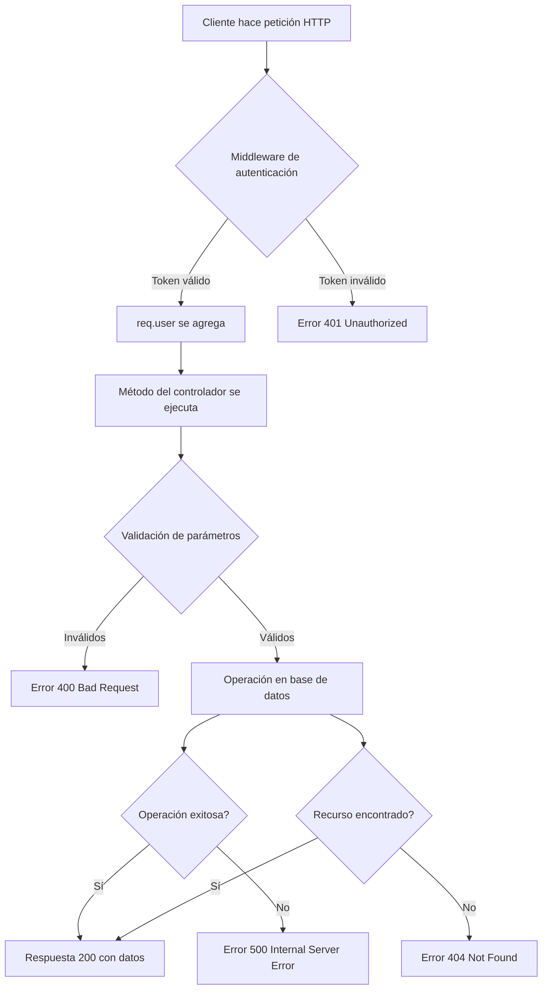

# Documentación: alert.controller.ts

**Ubicación:** `src/controllers/alert.controller.ts`

**Propósito:** Este archivo define el controlador de alertas que maneja todas las operaciones relacionadas con las alertas del sistema (obtener, marcar como leídas, eliminar, generar). Actúa como intermediario entre las rutas HTTP y la lógica de negocio/base de datos.

---

## Análisis Línea por Línea

### Líneas 1-4: Importaciones

```typescript
import { Request, Response } from 'express';
import { Alert } from '../models/Alert.model';
import { alertGenerator } from '../core/alertGenerator';
import mongoose from 'mongoose';
```

#### Línea 1: Importación de tipos de Express
```typescript
import { Request, Response } from 'express';
```

**¿Qué hace?**
- Importa los tipos `Request` y `Response` desde la librería `express`
- **Express** es un framework web minimalista para Node.js que facilita la creación de APIs REST
- **Request**: Tipo TypeScript que representa la solicitud HTTP entrante
  - Contiene información como: parámetros, query strings, body, headers, cookies
- **Response**: Tipo TypeScript que representa la respuesta HTTP que se enviará al cliente
  - Permite enviar datos, establecer códigos de estado, headers, etc.

**¿Por qué se usa?**
- TypeScript necesita conocer la estructura de estos objetos para proporcionar autocompletado y verificación de tipos
- Mejora la experiencia de desarrollo y previene errores

---

#### Línea 2: Importación del modelo Alert
```typescript
import { Alert } from '../models/Alert.model';
```

**¿Qué hace?**
- Importa el modelo `Alert` desde el archivo de modelos
- **Alert** es un modelo de Mongoose que representa la estructura de una alerta en MongoDB
- Define el esquema (schema) de cómo se almacenan las alertas en la base de datos

**¿Qué contiene el modelo Alert?**
Típicamente incluye campos como:
- `userId`: ID del usuario al que pertenece la alerta
- `type`: Tipo de alerta (presupuesto, ahorro, etc.)
- `severity`: Nivel de severidad (baja, media, alta)
- `message`: Mensaje de la alerta
- `isRead`: Si la alerta ha sido leída
- `createdAt`: Fecha de creación

**¿Por qué se usa?**
- Permite realizar operaciones CRUD (Create, Read, Update, Delete) en la colección de alertas
- Proporciona métodos como `find()`, `findOne()`, `updateMany()`, etc.

---

#### Línea 3: Importación del generador de alertas
```typescript
import { alertGenerator } from '../core/alertGenerator';
```

**¿Qué hace?**
- Importa el objeto `alertGenerator` desde el módulo core
- **alertGenerator** es un servicio que contiene la lógica de negocio para generar alertas automáticas
- Analiza transacciones, presupuestos y metas para crear alertas relevantes

**¿Por qué se usa?**
- Separa la lógica de generación de alertas del controlador
- Permite reutilizar la lógica de generación en diferentes partes de la aplicación
- Facilita el testing y mantenimiento del código

---

#### Línea 4: Importación de Mongoose
```typescript
import mongoose from 'mongoose';
```

**¿Qué hace?**
- Importa la librería completa de Mongoose
- En este archivo se usa específicamente para validar ObjectIds de MongoDB

**¿Por qué se usa?**
- `mongoose.Types.ObjectId.isValid()`: Valida si un string es un ObjectId válido de MongoDB
- Previene errores al intentar buscar documentos con IDs inválidos

---

### Línea 5: Línea en blanco
```typescript

```
**¿Qué hace?**
- Línea en blanco para mejorar la legibilidad del código
- Separa las importaciones de la definición de la clase

---

### Línea 6: Declaración de la clase AlertController
```typescript
export class AlertController {
```

**¿Qué hace?**
- **`export`**: Permite que esta clase sea importada en otros archivos
- **`class`**: Palabra clave de JavaScript/TypeScript para definir una clase
- **`AlertController`**: Nombre de la clase que agrupa todos los métodos relacionados con alertas

**¿Qué es una clase?**
- Un blueprint (plantilla) para crear objetos
- Agrupa datos y funcionalidad relacionada
- En este caso, agrupa todos los métodos que manejan operaciones de alertas

**¿Por qué usar una clase?**
- **Organización**: Agrupa métodos relacionados
- **Reutilización**: Se puede crear una instancia y usar en las rutas
- **Mantenibilidad**: Código más estructurado y fácil de mantener
- **Escalabilidad**: Fácil agregar nuevos métodos

---

### Líneas 7-32: Método getAlerts

```typescript
async getAlerts(req: Request, res: Response): Promise<Response> {
```

#### Línea 7: Firma del método getAlerts
**¿Qué hace?**
- **`async`**: Indica que el método es asíncrono y puede usar `await`
- **`getAlerts`**: Nombre del método que obtiene todas las alertas del usuario
- **`req: Request`**: Parámetro que recibe la solicitud HTTP con tipo Request
- **`res: Response`**: Parámetro que recibe el objeto de respuesta HTTP
- **`: Promise<Response>`**: Tipo de retorno - una promesa que resuelve a un objeto Response

**¿Por qué es async?**
- Las operaciones de base de datos son asíncronas
- Permite usar `await` para esperar resultados sin bloquear el hilo de ejecución

---

#### Línea 8: Inicio del bloque try
```typescript
try {
```

**¿Qué hace?**
- Inicia un bloque try-catch para manejo de errores
- Todo el código dentro del try será monitoreado por errores

**¿Por qué se usa?**
- Las operaciones de BD pueden fallar (conexión perdida, errores de validación, etc.)
- Permite manejar errores de forma elegante y enviar respuestas apropiadas al cliente

---

#### Línea 9: Obtención del ID del usuario
```typescript
const userId = req.user?.id;
```

**¿Qué hace?**
- **`const userId`**: Declara una constante para almacenar el ID del usuario
- **`req.user`**: Objeto que contiene información del usuario autenticado
  - Este objeto es agregado por un middleware de autenticación (típicamente JWT)
- **`?.`**: Operador de encadenamiento opcional (optional chaining)
  - Si `req.user` es `null` o `undefined`, retorna `undefined` en lugar de lanzar un error
- **`.id`**: Accede a la propiedad `id` del objeto user

**¿De dónde viene req.user?**
- Es agregado por un middleware de autenticación que se ejecuta antes del controlador
- El middleware verifica el token JWT y extrae la información del usuario
- Ejemplo de middleware:
```typescript
// En middleware/auth.ts
req.user = { id: '123abc', email: 'user@example.com' };
```

**¿Por qué usar optional chaining?**
- Previene errores si el middleware de autenticación falla
- Hace el código más robusto

---

#### Línea 10: Extracción de parámetros de query
```typescript
const { isRead, severity, type } = req.query;
```

**¿Qué hace?**
- **Destructuring**: Extrae múltiples propiedades del objeto `req.query` en una sola línea
- **`req.query`**: Objeto que contiene los parámetros de la URL (query string)
- **`isRead`**: Filtro para alertas leídas/no leídas
- **`severity`**: Filtro por nivel de severidad
- **`type`**: Filtro por tipo de alerta

**Ejemplo de URL:**
```
GET /api/alerts?isRead=false&severity=high&type=budget
```
Resulta en:
```javascript
{ isRead: 'false', severity: 'high', type: 'budget' }
```

**¿Por qué se usa?**
- Permite al frontend filtrar alertas según diferentes criterios
- Hace la API más flexible y útil

---

#### Línea 11: Línea en blanco
```typescript

```
**¿Qué hace?**
- Mejora la legibilidad separando la extracción de parámetros de la construcción del filtro

---

#### Línea 12: Inicialización del objeto filtro
```typescript
const filter: any = { userId };
```

**¿Qué hace?**
- **`const filter`**: Declara una constante para el objeto de filtro de MongoDB
- **`: any`**: Tipo TypeScript que permite cualquier estructura (no es ideal, pero es flexible)
- **`{ userId }`**: Sintaxis abreviada de ES6, equivalente a `{ userId: userId }`
  - Crea un objeto con la propiedad `userId` que tiene el valor de la variable `userId`

**¿Para qué se usa?**
- Este objeto se pasará a `Alert.find(filter)` para filtrar las alertas
- Siempre filtra por `userId` para que los usuarios solo vean sus propias alertas (seguridad)

**Ejemplo del objeto:**
```javascript
{ userId: '507f1f77bcf86cd799439011' }
```

---

#### Línea 13: Filtro condicional por isRead
```typescript
if (isRead !== undefined) filter.isRead = isRead === 'true';
```

**¿Qué hace?**
- **`if (isRead !== undefined)`**: Verifica si el parámetro `isRead` fue proporcionado en la query
  - `!==` es el operador de desigualdad estricta
  - Solo agrega el filtro si el usuario lo especificó
- **`filter.isRead`**: Agrega la propiedad `isRead` al objeto filtro
- **`isRead === 'true'`**: Convierte el string 'true' a booleano `true`
  - Los query params siempre son strings, necesitamos convertirlos a booleanos

**¿Por qué esta lógica?**
- `req.query` siempre contiene strings, no booleanos
- `'false' === 'true'` → `false` (booleano)
- `'true' === 'true'` → `true` (booleano)

**Ejemplo:**
```javascript
// URL: ?isRead=true
filter = { userId: '123', isRead: true }

// URL: ?isRead=false
filter = { userId: '123', isRead: false }

// URL: sin parámetro isRead
filter = { userId: '123' }
```

---

#### Línea 14: Filtro condicional por severity
```typescript
if (severity) filter.severity = severity;
```

**¿Qué hace?**
- **`if (severity)`**: Verifica si el parámetro `severity` existe y no es vacío
  - En JavaScript, strings vacíos, `null`, `undefined` son "falsy"
- **`filter.severity = severity`**: Agrega el filtro de severidad al objeto

**Ejemplo:**
```javascript
// URL: ?severity=high
filter = { userId: '123', severity: 'high' }
```

**Valores típicos de severity:**
- `'low'`: Severidad baja
- `'medium'`: Severidad media
- `'high'`: Severidad alta
- `'critical'`: Severidad crítica

---

#### Línea 15: Filtro condicional por type
```typescript
if (type) filter.type = type;
```

**¿Qué hace?**
- Similar a la línea anterior
- Agrega filtro por tipo de alerta si fue proporcionado

**Ejemplo:**
```javascript
// URL: ?type=budget
filter = { userId: '123', type: 'budget' }
```

**Valores típicos de type:**
- `'budget'`: Alerta de presupuesto excedido
- `'goal'`: Alerta relacionada con metas
- `'unusual_spending'`: Gasto inusual detectado
- `'savings'`: Alerta de ahorro

---

#### Línea 16: Línea en blanco
```typescript

```
**¿Qué hace?**
- Separa la construcción del filtro de la consulta a la base de datos

---

#### Línea 17: Consulta a la base de datos
```typescript
const alerts = await Alert.find(filter).sort({ createdAt: -1 }).lean();
```

**¿Qué hace?**
- **`const alerts`**: Variable que almacenará el array de alertas encontradas
- **`await`**: Espera a que la promesa se resuelva antes de continuar
- **`Alert.find(filter)`**: Método de Mongoose que busca documentos que coincidan con el filtro
  - Retorna un array de documentos (puede ser vacío)
- **`.sort({ createdAt: -1 })`**: Ordena los resultados
  - `createdAt`: Campo por el cual ordenar
  - `-1`: Orden descendente (más recientes primero)
  - `1` sería orden ascendente
- **`.lean()`**: Optimización de Mongoose
  - Retorna objetos JavaScript planos en lugar de documentos Mongoose
  - Más rápido y usa menos memoria
  - No tiene métodos de Mongoose (save, remove, etc.)

**¿Por qué ordenar por createdAt descendente?**
- Los usuarios quieren ver las alertas más recientes primero
- Mejora la experiencia de usuario

**Ejemplo de resultado:**
```javascript
[
  { _id: '1', message: 'Presupuesto excedido', createdAt: '2025-11-27T10:00:00Z' },
  { _id: '2', message: 'Meta alcanzada', createdAt: '2025-11-26T15:30:00Z' },
  { _id: '3', message: 'Gasto inusual', createdAt: '2025-11-25T08:20:00Z' }
]
```

---

#### Línea 18: Línea en blanco
```typescript

```
**¿Qué hace?**
- Separa la consulta de la respuesta

---

#### Líneas 19-23: Respuesta exitosa
```typescript
return res.status(200).json({
  success: true,
  data: alerts,
  total: alerts.length,
});
```

**¿Qué hace?**
- **`return`**: Retorna la respuesta y termina la ejecución del método
- **`res.status(200)`**: Establece el código de estado HTTP a 200 (OK - éxito)
- **`.json()`**: Envía una respuesta en formato JSON
- **`success: true`**: Indica que la operación fue exitosa
- **`data: alerts`**: Contiene el array de alertas encontradas
- **`total: alerts.length`**: Número total de alertas (útil para paginación)

**Códigos de estado HTTP:**
- `200`: OK - Solicitud exitosa
- `201`: Created - Recurso creado exitosamente
- `400`: Bad Request - Solicitud inválida
- `404`: Not Found - Recurso no encontrado
- `500`: Internal Server Error - Error del servidor

**Ejemplo de respuesta:**
```json
{
  "success": true,
  "data": [
    {
      "_id": "507f1f77bcf86cd799439011",
      "userId": "507f191e810c19729de860ea",
      "type": "budget",
      "severity": "high",
      "message": "Has excedido tu presupuesto mensual",
      "isRead": false,
      "createdAt": "2025-11-27T10:00:00.000Z"
    }
  ],
  "total": 1
}
```

---

#### Línea 24: Inicio del bloque catch
```typescript
} catch (error) {
```

**¿Qué hace?**
- Captura cualquier error que ocurra en el bloque try
- **`error`**: Variable que contiene el objeto de error

**¿Cuándo se ejecuta?**
- Error de conexión a la base de datos
- Error en la consulta
- Cualquier excepción no manejada

---

#### Línea 25: Log del error
```typescript
console.error('Error al obtener alertas:', error);
```

**¿Qué hace?**
- **`console.error()`**: Imprime el error en la consola del servidor
- Útil para debugging y monitoreo

**¿Por qué es importante?**
- Permite a los desarrolladores ver qué salió mal
- Facilita el debugging en desarrollo
- En producción, estos logs pueden ser capturados por herramientas de monitoreo

---

#### Líneas 26-30: Respuesta de error
```typescript
return res.status(500).json({
  success: false,
  message: 'Error al obtener alertas',
  error: error instanceof Error ? error.message : 'Error desconocido',
});
```

**¿Qué hace?**
- **`res.status(500)`**: Código de estado 500 (Internal Server Error)
- **`success: false`**: Indica que la operación falló
- **`message`**: Mensaje descriptivo del error para el usuario
- **`error instanceof Error`**: Verifica si el error es una instancia de la clase Error
  - Si es true: usa `error.message` (el mensaje del error)
  - Si es false: usa `'Error desconocido'` (por si el error no es un objeto Error estándar)

**¿Por qué verificar instanceof Error?**
- En JavaScript, se puede lanzar cualquier cosa como error (strings, números, objetos)
- Esta verificación asegura que podemos acceder a `.message` de forma segura

**Ejemplo de respuesta de error:**
```json
{
  "success": false,
  "message": "Error al obtener alertas",
  "error": "Connection to database failed"
}
```

---

#### Líneas 31-32: Cierre del método
```typescript
  }
}
```

**¿Qué hace?**
- Línea 31: Cierra el bloque catch
- Línea 32: Cierra el método `getAlerts`

---

### Líneas 34-67: Método getAlertById

```typescript
async getAlertById(req: Request, res: Response): Promise<Response> {
```

#### Línea 34: Firma del método
**¿Qué hace?**
- Método para obtener una alerta específica por su ID
- Similar a `getAlerts` pero retorna una sola alerta

---

#### Líneas 36-37: Extracción de parámetros
```typescript
const { id } = req.params;
const userId = req.user?.id;
```

**¿Qué hace?**
- **`req.params`**: Objeto que contiene parámetros de la ruta (URL parameters)
- **`id`**: ID de la alerta a buscar

**Diferencia entre req.params y req.query:**
- **req.params**: Parámetros en la ruta → `/api/alerts/:id` → `req.params.id`
- **req.query**: Parámetros de query string → `/api/alerts?type=budget` → `req.query.type`

**Ejemplo:**
```
URL: GET /api/alerts/507f1f77bcf86cd799439011
req.params = { id: '507f1f77bcf86cd799439011' }
```

---

#### Líneas 39-44: Validación del ID
```typescript
if (!mongoose.Types.ObjectId.isValid(id)) {
  return res.status(400).json({
    success: false,
    message: 'ID de alerta inválido',
  });
}
```

**¿Qué hace?**
- **`mongoose.Types.ObjectId.isValid(id)`**: Método de Mongoose que valida si un string es un ObjectId válido
  - ObjectId de MongoDB tiene un formato específico (24 caracteres hexadecimales)
- **`!`**: Operador de negación - si NO es válido
- **`return res.status(400)`**: Retorna error 400 (Bad Request) si el ID es inválido

**¿Por qué validar?**
- Previene errores al intentar buscar con un ID inválido
- Proporciona feedback claro al cliente
- Mejora la seguridad y robustez de la API

**Ejemplos:**
```javascript
// Válido
'507f1f77bcf86cd799439011' → true

// Inválidos
'123' → false
'invalid-id' → false
'507f1f77bcf86cd79943901g' → false (contiene 'g' que no es hexadecimal)
```

---

#### Línea 46: Búsqueda de la alerta
```typescript
const alert = await Alert.findOne({ _id: id, userId }).lean();
```

**¿Qué hace?**
- **`Alert.findOne()`**: Método de Mongoose que busca UN solo documento
  - Retorna el primer documento que coincida o `null` si no encuentra nada
- **`{ _id: id, userId }`**: Filtro que busca por ID Y userId
  - `_id: id`: Busca por el ID de la alerta
  - `userId`: Asegura que la alerta pertenece al usuario autenticado (seguridad)
- **`.lean()`**: Retorna un objeto JavaScript plano

**¿Por qué filtrar por userId también?**
- **Seguridad**: Previene que un usuario acceda a alertas de otros usuarios
- Aunque el ID sea válido, solo puede ver sus propias alertas
- Implementa autorización a nivel de datos

**Ejemplo:**
```javascript
// Usuario A intenta acceder a alerta de Usuario B
{ _id: '507f1f77bcf86cd799439011', userId: 'userA' }
// Si la alerta pertenece a userB, findOne retorna null
```

---

#### Líneas 48-53: Manejo de alerta no encontrada
```typescript
if (!alert) {
  return res.status(404).json({
    success: false,
    message: 'Alerta no encontrada',
  });
}
```

**¿Qué hace?**
- **`if (!alert)`**: Verifica si la alerta es `null` (no encontrada)
- **`res.status(404)`**: Código 404 (Not Found)
- Retorna un mensaje indicando que la alerta no existe

**¿Cuándo ocurre?**
- El ID no existe en la base de datos
- La alerta pertenece a otro usuario
- La alerta fue eliminada

---

#### Líneas 55-58: Respuesta exitosa
```typescript
return res.status(200).json({
  success: true,
  data: alert,
});
```

**¿Qué hace?**
- Retorna la alerta encontrada con código 200
- No incluye `total` porque es una sola alerta

**Ejemplo de respuesta:**
```json
{
  "success": true,
  "data": {
    "_id": "507f1f77bcf86cd799439011",
    "userId": "507f191e810c19729de860ea",
    "type": "budget",
    "severity": "high",
    "message": "Has excedido tu presupuesto mensual",
    "isRead": false,
    "createdAt": "2025-11-27T10:00:00.000Z"
  }
}
```

---

#### Líneas 59-66: Manejo de errores
```typescript
} catch (error) {
  console.error('Error al obtener alerta:', error);
  return res.status(500).json({
    success: false,
    message: 'Error al obtener alerta',
    error: error instanceof Error ? error.message : 'Error desconocido',
  });
}
```

**¿Qué hace?**
- Similar al método anterior
- Captura y maneja errores inesperados

---

### Líneas 69-107: Método markAsRead

```typescript
async markAsRead(req: Request, res: Response): Promise<Response> {
```

#### Línea 69: Firma del método
**¿Qué hace?**
- Método para marcar una alerta específica como leída
- Actualiza el campo `isRead` a `true`

---

#### Líneas 71-79: Extracción y validación
```typescript
const { id } = req.params;
const userId = req.user?.id;

if (!mongoose.Types.ObjectId.isValid(id)) {
  return res.status(400).json({
    success: false,
    message: 'ID de alerta inválido',
  });
}
```

**¿Qué hace?**
- Similar a `getAlertById`
- Extrae el ID y valida su formato

---

#### Líneas 81-85: Actualización de la alerta
```typescript
const alert = await Alert.findOneAndUpdate(
  { _id: id, userId },
  { isRead: true },
  { new: true }
);
```

**¿Qué hace?**
- **`Alert.findOneAndUpdate()`**: Método de Mongoose que busca y actualiza un documento en una sola operación
- **Primer parámetro** `{ _id: id, userId }`: Filtro para encontrar la alerta
- **Segundo parámetro** `{ isRead: true }`: Actualización a aplicar
- **Tercer parámetro** `{ new: true }`: Opciones
  - `new: true`: Retorna el documento actualizado (después de la actualización)
  - `new: false` (default): Retornaría el documento antes de la actualización

**¿Por qué usar findOneAndUpdate?**
- **Atómico**: La operación es atómica (no hay condiciones de carrera)
- **Eficiente**: Una sola operación en lugar de buscar y luego actualizar
- **Conveniente**: Retorna el documento actualizado directamente

**Ejemplo:**
```javascript
// Antes de la actualización
{ _id: '123', isRead: false, message: 'Alerta' }

// Después de la actualización (con new: true)
{ _id: '123', isRead: true, message: 'Alerta' }
```

---

#### Líneas 87-92: Manejo de alerta no encontrada
```typescript
if (!alert) {
  return res.status(404).json({
    success: false,
    message: 'Alerta no encontrada',
  });
}
```

**¿Qué hace?**
- Similar a `getAlertById`
- Si no encuentra la alerta, retorna 404

---

#### Líneas 94-98: Respuesta exitosa
```typescript
return res.status(200).json({
  success: true,
  message: 'Alerta marcada como leída',
  data: alert,
});
```

**¿Qué hace?**
- Retorna la alerta actualizada
- Incluye un mensaje descriptivo de la acción realizada

**Ejemplo de respuesta:**
```json
{
  "success": true,
  "message": "Alerta marcada como leída",
  "data": {
    "_id": "507f1f77bcf86cd799439011",
    "userId": "507f191e810c19729de860ea",
    "type": "budget",
    "severity": "high",
    "message": "Has excedido tu presupuesto mensual",
    "isRead": true,
    "createdAt": "2025-11-27T10:00:00.000Z"
  }
}
```

---

### Líneas 109-130: Método markAllAsRead

```typescript
async markAllAsRead(req: Request, res: Response): Promise<Response> {
```

#### Línea 109: Firma del método
**¿Qué hace?**
- Método para marcar TODAS las alertas no leídas del usuario como leídas
- Útil para la funcionalidad "marcar todas como leídas"

---

#### Línea 111: Obtención del userId
```typescript
const userId = req.user?.id;
```

**¿Qué hace?**
- Extrae el ID del usuario autenticado
- No necesita ID de alerta porque actualiza todas

---

#### Línea 113: Actualización masiva
```typescript
const result = await Alert.updateMany({ userId, isRead: false }, { isRead: true });
```

**¿Qué hace?**
- **`Alert.updateMany()`**: Método de Mongoose que actualiza MÚLTIPLES documentos
- **Primer parámetro** `{ userId, isRead: false }`: Filtro
  - `userId`: Solo alertas del usuario actual
  - `isRead: false`: Solo alertas no leídas
- **Segundo parámetro** `{ isRead: true }`: Actualización a aplicar
- **`result`**: Objeto que contiene información sobre la operación
  - `modifiedCount`: Número de documentos modificados
  - `matchedCount`: Número de documentos que coincidieron con el filtro
  - `acknowledged`: Si la operación fue reconocida por MongoDB

**Diferencia entre updateMany y findOneAndUpdate:**
- **updateMany**: Actualiza múltiples documentos, no retorna los documentos
- **findOneAndUpdate**: Actualiza un solo documento, retorna el documento

**Ejemplo de result:**
```javascript
{
  acknowledged: true,
  modifiedCount: 5,
  matchedCount: 5,
  upsertedCount: 0,
  upsertedId: null
}
```

---

#### Líneas 115-121: Respuesta exitosa
```typescript
return res.status(200).json({
  success: true,
  message: 'Todas las alertas marcadas como leídas',
  data: {
    modifiedCount: result.modifiedCount,
  },
});
```

**¿Qué hace?**
- Retorna el número de alertas modificadas
- Útil para mostrar feedback al usuario ("5 alertas marcadas como leídas")

**Ejemplo de respuesta:**
```json
{
  "success": true,
  "message": "Todas las alertas marcadas como leídas",
  "data": {
    "modifiedCount": 5
  }
}
```

---

### Líneas 132-168: Método deleteAlert

```typescript
async deleteAlert(req: Request, res: Response): Promise<Response> {
```

#### Línea 132: Firma del método
**¿Qué hace?**
- Método para eliminar una alerta específica
- Operación destructiva que no se puede deshacer

---

#### Líneas 134-142: Extracción y validación
```typescript
const { id } = req.params;
const userId = req.user?.id;

if (!mongoose.Types.ObjectId.isValid(id)) {
  return res.status(400).json({
    success: false,
    message: 'ID de alerta inválido',
  });
}
```

**¿Qué hace?**
- Similar a métodos anteriores
- Extrae y valida el ID de la alerta

---

#### Línea 144: Eliminación de la alerta
```typescript
const alert = await Alert.findOneAndDelete({ _id: id, userId });
```

**¿Qué hace?**
- **`Alert.findOneAndDelete()`**: Método de Mongoose que busca y elimina un documento
- **`{ _id: id, userId }`**: Filtro (seguridad: solo puede eliminar sus propias alertas)
- Retorna el documento eliminado o `null` si no se encontró

**¿Por qué retorna el documento eliminado?**
- Permite confirmar qué se eliminó
- Útil para logging o auditoría
- Puede usarse para "deshacer" la operación si es necesario

---

#### Líneas 146-151: Manejo de alerta no encontrada
```typescript
if (!alert) {
  return res.status(404).json({
    success: false,
    message: 'Alerta no encontrada',
  });
}
```

**¿Qué hace?**
- Si no encuentra la alerta, retorna 404
- Puede ser porque no existe o pertenece a otro usuario

---

#### Líneas 153-159: Respuesta exitosa
```typescript
return res.status(200).json({
  success: true,
  message: 'Alerta eliminada exitosamente',
  data: {
    id: alert._id,
  },
});
```

**¿Qué hace?**
- Confirma la eliminación
- Retorna el ID de la alerta eliminada

**Ejemplo de respuesta:**
```json
{
  "success": true,
  "message": "Alerta eliminada exitosamente",
  "data": {
    "id": "507f1f77bcf86cd799439011"
  }
}
```

---

### Líneas 170-190: Método getUnreadCount

```typescript
async getUnreadCount(req: Request, res: Response): Promise<Response> {
```

#### Línea 170: Firma del método
**¿Qué hace?**
- Método para obtener el número de alertas no leídas
- Útil para mostrar badges/notificaciones en la UI

---

#### Línea 172: Obtención del userId
```typescript
const userId = req.user?.id;
```

**¿Qué hace?**
- Extrae el ID del usuario autenticado

---

#### Línea 174: Conteo de alertas no leídas
```typescript
const count = await Alert.countDocuments({ userId, isRead: false });
```

**¿Qué hace?**
- **`Alert.countDocuments()`**: Método de Mongoose que cuenta documentos que coinciden con el filtro
- **`{ userId, isRead: false }`**: Filtro para contar solo alertas no leídas del usuario
- Retorna un número (puede ser 0)

**¿Por qué usar countDocuments?**
- **Eficiente**: No carga los documentos completos, solo cuenta
- **Rápido**: Optimizado para conteo
- **Menos memoria**: No necesita cargar todos los documentos

**Diferencia con find().length:**
```javascript
// ❌ Ineficiente - carga todos los documentos
const alerts = await Alert.find({ userId, isRead: false });
const count = alerts.length;

// ✅ Eficiente - solo cuenta
const count = await Alert.countDocuments({ userId, isRead: false });
```

---

#### Líneas 176-181: Respuesta exitosa
```typescript
return res.status(200).json({
  success: true,
  data: {
    unreadCount: count,
  },
});
```

**¿Qué hace?**
- Retorna el número de alertas no leídas

**Ejemplo de respuesta:**
```json
{
  "success": true,
  "data": {
    "unreadCount": 3
  }
}
```

**Uso en el frontend:**
```javascript
// Mostrar badge con el número
<Badge count={unreadCount} />
// Resultado: 🔔 3
```

---

### Líneas 192-210: Método generateAlerts

```typescript
async generateAlerts(req: Request, res: Response): Promise<Response> {
```

#### Línea 192: Firma del método
**¿Qué hace?**
- Método para generar alertas automáticamente
- Ejecuta todas las verificaciones del sistema de alertas

---

#### Línea 194: Obtención del userId
```typescript
const userId = req.user?.id;
```

**¿Qué hace?**
- Extrae el ID del usuario autenticado

---

#### Línea 196: Generación de alertas
```typescript
await alertGenerator.runAllChecks(userId!);
```

**¿Qué hace?**
- **`alertGenerator`**: Objeto importado que contiene la lógica de generación de alertas
- **`.runAllChecks()`**: Método que ejecuta todas las verificaciones
  - Analiza transacciones recientes
  - Verifica presupuestos
  - Revisa metas
  - Detecta patrones inusuales
  - Crea alertas según sea necesario
- **`userId!`**: El operador `!` (non-null assertion) le dice a TypeScript que `userId` no es `null` o `undefined`
  - Es seguro aquí porque el middleware de autenticación garantiza que `req.user` existe

**¿Qué hace runAllChecks internamente?**
Típicamente:
1. Obtiene transacciones del usuario
2. Verifica si excedió presupuestos
3. Verifica progreso de metas
4. Detecta gastos inusuales
5. Crea alertas en la base de datos

**¿Por qué usar el operador !?**
```typescript
// Sin !
await alertGenerator.runAllChecks(userId);
// TypeScript error: userId puede ser undefined

// Con !
await alertGenerator.runAllChecks(userId!);
// Le decimos a TypeScript: "confía en mí, userId existe"
```

---

#### Líneas 198-201: Respuesta exitosa
```typescript
return res.status(200).json({
  success: true,
  message: 'Alertas generadas exitosamente',
});
```

**¿Qué hace?**
- Confirma que las alertas fueron generadas
- No retorna las alertas creadas (el usuario puede obtenerlas con `getAlerts`)

**Ejemplo de respuesta:**
```json
{
  "success": true,
  "message": "Alertas generadas exitosamente"
}
```

**¿Cuándo se usa este endpoint?**
- Puede ser llamado manualmente por el usuario
- Puede ser ejecutado por un cron job periódicamente
- Puede ser disparado después de crear transacciones

---

#### Líneas 202-209: Manejo de errores
```typescript
} catch (error) {
  console.error('Error al generar alertas:', error);
  return res.status(500).json({
    success: false,
    message: 'Error al generar alertas',
    error: error instanceof Error ? error.message : 'Error desconocido',
  });
}
```

**¿Qué hace?**
- Captura errores durante la generación de alertas
- Retorna error 500 si algo falla

---

### Líneas 211-214: Exportación de la instancia

```typescript
}

export const alertController = new AlertController();
```

#### Línea 211: Cierre de la clase
```typescript
}
```

**¿Qué hace?**
- Cierra la definición de la clase `AlertController`

---

#### Línea 213: Creación y exportación de instancia
```typescript
export const alertController = new AlertController();
```

**¿Qué hace?**
- **`new AlertController()`**: Crea una nueva instancia de la clase
- **`export const alertController`**: Exporta la instancia (no la clase)
- **Patrón Singleton**: Solo hay una instancia del controlador en toda la aplicación

**¿Por qué exportar una instancia en lugar de la clase?**
- **Conveniencia**: No necesitas crear una instancia cada vez que la uses
- **Consistencia**: Todos los módulos usan la misma instancia
- **Simplicidad**: Más fácil de importar y usar

**Uso en las rutas:**
```typescript
// En routes/alert.routes.ts
import { alertController } from '../controllers/alert.controller';

router.get('/alerts', authMiddleware, alertController.getAlerts);
router.get('/alerts/:id', authMiddleware, alertController.getAlertById);
router.patch('/alerts/:id/read', authMiddleware, alertController.markAsRead);
```

---

## Flujo de Ejecución General



---

## Resumen de Métodos

| Método | Ruta | Descripción | Retorna |
|--------|------|-------------|---------|
| `getAlerts` | GET /alerts | Obtiene todas las alertas del usuario con filtros opcionales | Array de alertas |
| `getAlertById` | GET /alerts/:id | Obtiene una alerta específica por ID | Una alerta |
| `markAsRead` | PATCH /alerts/:id/read | Marca una alerta como leída | Alerta actualizada |
| `markAllAsRead` | PATCH /alerts/read-all | Marca todas las alertas como leídas | Número de alertas actualizadas |
| `deleteAlert` | DELETE /alerts/:id | Elimina una alerta | ID de alerta eliminada |
| `getUnreadCount` | GET /alerts/unread-count | Obtiene el número de alertas no leídas | Número |
| `generateAlerts` | POST /alerts/generate | Genera alertas automáticamente | Mensaje de confirmación |

---

## Dependencias

### Externas
- **express**: Framework web para Node.js
  - Tipos: `Request`, `Response`
- **mongoose**: ODM para MongoDB
  - Validación de ObjectId
  - Métodos de consulta

### Internas
- **Alert** (`../models/Alert.model`): Modelo de Mongoose para alertas
- **alertGenerator** (`../core/alertGenerator`): Servicio de generación de alertas

---

## Seguridad Implementada

✅ **Autenticación**: Todos los métodos requieren `req.user` (token JWT)  
✅ **Autorización**: Filtrado por `userId` en todas las consultas  
✅ **Validación**: Validación de ObjectIds antes de consultar  
✅ **Aislamiento de datos**: Los usuarios solo pueden ver/modificar sus propias alertas  

---

## Mejores Prácticas Implementadas

✅ **Manejo de errores**: Try-catch en todos los métodos  
✅ **Códigos HTTP apropiados**: 200, 400, 404, 500  
✅ **Respuestas consistentes**: Formato `{ success, data/message, error }`  
✅ **Validación de entrada**: Verificación de IDs y parámetros  
✅ **Logging**: Console.error para debugging  
✅ **Optimización**: Uso de `.lean()` para mejor performance  
✅ **Operaciones atómicas**: `findOneAndUpdate`, `findOneAndDelete`  

---

## Posibles Mejoras

1. **Paginación en getAlerts:**
```typescript
const page = parseInt(req.query.page as string) || 1;
const limit = parseInt(req.query.limit as string) || 10;
const skip = (page - 1) * limit;

const alerts = await Alert.find(filter)
  .sort({ createdAt: -1 })
  .skip(skip)
  .limit(limit)
  .lean();
```

2. **Validación con biblioteca dedicada:**
```typescript
import { z } from 'zod';

const alertIdSchema = z.string().refine(id => mongoose.Types.ObjectId.isValid(id));
```

3. **Soft delete en lugar de eliminación permanente:**
```typescript
// Agregar campo deletedAt al modelo
await Alert.findOneAndUpdate(
  { _id: id, userId },
  { deletedAt: new Date() }
);
```

4. **Rate limiting para generateAlerts:**
```typescript
// Prevenir abuso del endpoint de generación
import rateLimit from 'express-rate-limit';

const generateAlertsLimiter = rateLimit({
  windowMs: 15 * 60 * 1000, // 15 minutos
  max: 5 // máximo 5 solicitudes
});
```
