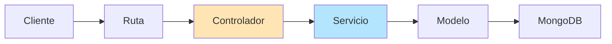

# Documentación: comparison.controller.ts

**Ubicación:** `src/controllers/comparison.controller.ts`

**Propósito:** Este archivo define el controlador de comparaciones que maneja diferentes tipos de análisis comparativos de datos financieros. Permite comparar gastos por categorías, períodos de tiempo, entre usuarios (solo admin), y datos reales vs predicciones.

---

## Análisis Línea por Línea

### Líneas 1-2: Importaciones

```typescript
import { Request, Response } from 'express';
import { comparisonService } from '../services/comparison.service';
```

#### Línea 1: Importación de tipos de Express
```typescript
import { Request, Response } from 'express';
```

**¿Qué hace?**
- Importa los tipos `Request` y `Response` de Express
- Proporciona tipado TypeScript para solicitudes y respuestas HTTP
- Misma función que en controladores anteriores

---

#### Línea 2: Importación del servicio de comparaciones
```typescript
import { comparisonService } from '../services/comparison.service';
```

**¿Qué hace?**
- Importa el servicio `comparisonService` que contiene la lógica de negocio
- **Patrón de diseño**: Separación de responsabilidades (Controller-Service)

**¿Qué es un servicio?**
- Capa que contiene la lógica de negocio compleja
- El controlador maneja HTTP, el servicio maneja la lógica
- Facilita testing y reutilización de código

**Arquitectura en capas:**
```
Cliente (Frontend)
    ↓
Rutas (Routes)
    ↓
Controlador (Controller) ← Maneja HTTP, validación básica
    ↓
Servicio (Service) ← Lógica de negocio, cálculos, agregaciones
    ↓
Modelo (Model) ← Acceso a base de datos
    ↓
Base de Datos (MongoDB)
```

**¿Por qué separar controlador y servicio?**
- **Responsabilidad única**: El controlador maneja HTTP, el servicio maneja lógica
- **Reutilización**: El servicio puede usarse desde diferentes controladores
- **Testing**: Más fácil testear la lógica sin HTTP
- **Mantenibilidad**: Código más organizado y limpio

**Ejemplo de lo que hace el servicio:**
```typescript
// En comparison.service.ts
class ComparisonService {
  async compareByCategory(userId: string, periods: number) {
    // 1. Obtener transacciones del usuario
    const transactions = await Transaction.find({ userId });
    
    // 2. Agrupar por categoría
    const grouped = this.groupByCategory(transactions);
    
    // 3. Calcular estadísticas
    const stats = this.calculateStats(grouped);
    
    // 4. Comparar períodos
    const comparison = this.comparePeriods(stats, periods);
    
    return comparison;
  }
}
```

---

### Línea 3: Línea en blanco
```typescript

```
**¿Qué hace?**
- Separa las importaciones de la definición de la clase

---

### Línea 4: Declaración de la clase
```typescript
export class ComparisonController {
```

**¿Qué hace?**
- **`export class`**: Exporta la clase para uso en otros archivos
- **`ComparisonController`**: Nombre de la clase
- Agrupa todos los métodos relacionados con comparaciones

---

### Líneas 5-28: Método compareByCategory

```typescript
/**
 * Compara datos por categoría
 */
async compareByCategory(req: Request, res: Response): Promise<Response> {
```

#### Líneas 5-7: Comentario JSDoc
```typescript
/**
 * Compara datos por categoría
 */
```

**¿Qué hace?**
- Documenta el propósito del método
- Indica que compara gastos/ingresos agrupados por categoría

**¿Qué es comparar por categoría?**
- Analiza cuánto se gasta en cada categoría a lo largo del tiempo
- Permite ver tendencias: ¿está aumentando el gasto en "Comida"?
- Identifica categorías con mayor variación

**Ejemplo de resultado:**
```javascript
{
  "Comida": {
    "promedio": 500,
    "tendencia": "aumentando",
    "variacion": "+15%"
  },
  "Transporte": {
    "promedio": 200,
    "tendencia": "estable",
    "variacion": "+2%"
  }
}
```

---

#### Línea 8: Firma del método
```typescript
async compareByCategory(req: Request, res: Response): Promise<Response> {
```

**¿Qué hace?**
- **`async`**: Método asíncrono
- **`compareByCategory`**: Nombre descriptivo del método
- **`Promise<Response>`**: Retorna una promesa que resuelve a Response

---

#### Línea 9: Inicio del bloque try
```typescript
try {
```

**¿Qué hace?**
- Inicia el manejo de errores con try-catch

---

#### Líneas 10-11: Extracción de parámetros
```typescript
const userId = req.user?.id;
const { periods = 6 } = req.query;
```

**¿Qué hace?**
- **Línea 10**: Obtiene el ID del usuario autenticado
- **Línea 11**: Extrae el parámetro `periods` de la query string
  - **`periods = 6`**: Valor por defecto de 6 períodos si no se especifica

**¿Qué son períodos?**
- Número de meses a analizar
- Por defecto: últimos 6 meses
- Permite ver tendencias a corto, mediano o largo plazo

**Ejemplo de URL:**
```
GET /api/comparisons/category?periods=12
```

Resulta en:
```javascript
periods = 12  // Analizar últimos 12 meses
```

**Destructuring con valor por defecto:**
```javascript
// Si periods no está en req.query
const { periods = 6 } = req.query;
// periods = 6

// Si periods está en req.query
const { periods = 6 } = { periods: '12' };
// periods = '12' (string)
```

---

#### Línea 12: Línea en blanco
```typescript

```
**¿Qué hace?**
- Mejora la legibilidad separando la extracción de parámetros de la llamada al servicio

---

#### Línea 13: Llamada al servicio
```typescript
const comparison = await comparisonService.compareByCategory(userId!, Number(periods));
```

**¿Qué hace?**
- **`comparisonService.compareByCategory()`**: Llama al método del servicio
- **`userId!`**: Operador de aserción no-null
  - Le dice a TypeScript: "confía en mí, userId no es undefined"
  - Seguro porque el middleware de autenticación garantiza que existe
- **`Number(periods)`**: Convierte el string a número
  - `req.query` siempre contiene strings
  - `Number('6')` → `6`

**¿Por qué usar Number()?**
- Los query params son siempre strings
- El servicio espera un número
- `Number()` convierte de forma segura

**Conversión de tipos:**
```javascript
Number('6')      → 6
Number('12')     → 12
Number('abc')    → NaN (Not a Number)
Number('')       → 0
Number(undefined) → NaN
```

**¿Qué hace el servicio internamente?**
Típicamente:
1. Obtiene transacciones del usuario de los últimos N períodos
2. Agrupa por categoría
3. Calcula promedios, totales, tendencias
4. Compara período actual vs períodos anteriores
5. Retorna análisis comparativo

**Ejemplo de resultado del servicio:**
```javascript
{
  categories: [
    {
      name: 'Comida',
      type: 'expense',
      periods: [
        { month: '2025-06', amount: 450 },
        { month: '2025-07', amount: 480 },
        { month: '2025-08', amount: 520 },
        { month: '2025-09', amount: 550 },
        { month: '2025-10', amount: 580 },
        { month: '2025-11', amount: 600 }
      ],
      average: 530,
      trend: 'increasing',
      percentageChange: 33.3
    },
    {
      name: 'Transporte',
      type: 'expense',
      periods: [...],
      average: 200,
      trend: 'stable',
      percentageChange: 5
    }
  ],
  summary: {
    totalCategories: 8,
    periodsAnalyzed: 6,
    highestGrowth: 'Comida',
    lowestGrowth: 'Entretenimiento'
  }
}
```

---

#### Línea 14: Línea en blanco
```typescript

```
**¿Qué hace?**
- Separa la llamada al servicio de la respuesta

---

#### Líneas 15-19: Respuesta exitosa
```typescript
return res.status(200).json({
    success: true,
    message: 'Comparación por categoría realizada exitosamente',
    data: comparison,
});
```

**¿Qué hace?**
- **`res.status(200)`**: Código 200 (OK)
- **`success: true`**: Indica éxito
- **`message`**: Mensaje descriptivo
- **`data: comparison`**: Resultado del análisis comparativo

**Ejemplo de respuesta completa:**
```json
{
  "success": true,
  "message": "Comparación por categoría realizada exitosamente",
  "data": {
    "categories": [
      {
        "name": "Comida",
        "type": "expense",
        "periods": [
          { "month": "2025-06", "amount": 450 },
          { "month": "2025-07", "amount": 480 },
          { "month": "2025-08", "amount": 520 }
        ],
        "average": 483.33,
        "trend": "increasing",
        "percentageChange": 15.6
      }
    ],
    "summary": {
      "totalCategories": 8,
      "periodsAnalyzed": 6
    }
  }
}
```

**Uso en el frontend:**
```javascript
// Mostrar gráfico de tendencias por categoría
const response = await fetch('/api/comparisons/category?periods=6');
const { data } = await response.json();

data.categories.forEach(category => {
  renderChart(category.name, category.periods);
  showTrend(category.trend, category.percentageChange);
});
```

---

#### Líneas 20-27: Manejo de errores
```typescript
} catch (error) {
    console.error('Error al comparar por categoría:', error);
    return res.status(500).json({
        success: false,
        message: 'Error al comparar por categoría',
        error: error instanceof Error ? error.message : 'Error desconocido',
    });
}
```

**¿Qué hace?**
- Captura errores del servicio
- Log del error en la consola
- Respuesta 500 (Internal Server Error)

**¿Cuándo se ejecuta?**
- Error al consultar la base de datos
- Error en cálculos del servicio
- Cualquier excepción no manejada

---

#### Línea 28: Cierre del método
```typescript
}
```

**¿Qué hace?**
- Cierra el método `compareByCategory`

---

### Líneas 30-53: Método compareByTime

```typescript
/**
 * Compara predicciones temporales
 */
async compareByTime(req: Request, res: Response): Promise<Response> {
```

#### Líneas 30-32: Comentario JSDoc
```typescript
/**
 * Compara predicciones temporales
 */
```

**¿Qué hace?**
- Documenta el método
- Indica que compara predicciones a lo largo del tiempo

**¿Qué es comparar por tiempo?**
- Analiza cómo han evolucionado las predicciones
- Compara predicciones antiguas con datos reales
- Evalúa la precisión del modelo de predicción

**Ejemplo de análisis temporal:**
```javascript
{
  "predictions": [
    {
      "date": "2025-06-01",
      "predicted": 1500,
      "actual": 1450,
      "accuracy": 96.7
    },
    {
      "date": "2025-07-01",
      "predicted": 1600,
      "actual": 1580,
      "accuracy": 98.8
    }
  ]
}
```

---

#### Líneas 35-36: Extracción de parámetros
```typescript
const userId = req.user?.id;
const { limit = 5 } = req.query;
```

**¿Qué hace?**
- **Línea 35**: Obtiene el ID del usuario
- **Línea 36**: Extrae el parámetro `limit` con valor por defecto de 5
  - **`limit`**: Número de predicciones a comparar

**¿Qué es limit?**
- Número máximo de predicciones a analizar
- Por defecto: 5 predicciones más recientes
- Evita sobrecargar la respuesta con demasiados datos

**Ejemplo:**
```
GET /api/comparisons/time?limit=10
```

Resulta en:
```javascript
limit = '10'  // String de la query
Number(limit) = 10  // Convertido a número en línea 38
```

---

#### Línea 38: Llamada al servicio
```typescript
const comparison = await comparisonService.compareByTime(userId!, Number(limit));
```

**¿Qué hace?**
- Llama al servicio con userId y límite convertido a número
- El servicio compara predicciones con datos reales

**¿Qué hace el servicio?**
1. Obtiene las últimas N predicciones del usuario
2. Para cada predicción, obtiene los datos reales del período
3. Calcula métricas de precisión (MAE, RMSE, MAPE)
4. Identifica tendencias en la precisión
5. Retorna análisis comparativo

**Métricas de precisión:**
- **MAE** (Mean Absolute Error): Error promedio absoluto
- **RMSE** (Root Mean Square Error): Raíz del error cuadrático medio
- **MAPE** (Mean Absolute Percentage Error): Error porcentual promedio

**Ejemplo de resultado:**
```javascript
{
  comparisons: [
    {
      predictionId: '507f...',
      date: '2025-11-01',
      predicted: 1500,
      actual: 1450,
      error: 50,
      accuracy: 96.7,
      mae: 50,
      mape: 3.3
    }
  ],
  summary: {
    averageAccuracy: 95.5,
    totalPredictions: 5,
    bestPrediction: { date: '2025-10-01', accuracy: 98.8 },
    worstPrediction: { date: '2025-08-01', accuracy: 89.2 }
  }
}
```

---

#### Líneas 40-44: Respuesta exitosa
```typescript
return res.status(200).json({
    success: true,
    message: 'Comparación temporal realizada exitosamente',
    data: comparison,
});
```

**¿Qué hace?**
- Retorna el análisis temporal con código 200

---

### Líneas 55-92: Método compareByUsers

```typescript
/**
 * Compara entre usuarios (solo admin)
 */
async compareByUsers(req: Request, res: Response): Promise<Response> {
```

#### Líneas 55-57: Comentario JSDoc
```typescript
/**
 * Compara entre usuarios (solo admin)
 */
```

**¿Qué hace?**
- Documenta que este método es solo para administradores
- Compara datos financieros entre diferentes usuarios

**¿Qué es comparar entre usuarios?**
- Análisis agregado de múltiples usuarios
- Útil para benchmarking y análisis de tendencias generales
- **Privacidad**: Solo admins pueden acceder

**Casos de uso:**
- Comparar patrones de gasto entre grupos demográficos
- Identificar usuarios con comportamientos similares
- Análisis de mercado y tendencias generales

**Ejemplo de resultado:**
```javascript
{
  users: [
    {
      userId: '507f...001',
      totalExpenses: 2500,
      averageMonthly: 833,
      topCategory: 'Comida'
    },
    {
      userId: '507f...002',
      totalExpenses: 3200,
      averageMonthly: 1067,
      topCategory: 'Transporte'
    }
  ],
  summary: {
    averageExpenses: 2850,
    mostCommonCategory: 'Comida',
    highestSpender: '507f...002'
  }
}
```

---

#### Línea 60: Comentario
```typescript
// Verificar que el usuario sea admin
```

**¿Qué hace?**
- Explica la validación de permisos

---

#### Líneas 61-66: Validación de permisos
```typescript
if (req.user?.role !== 'admin') {
    return res.status(403).json({
        success: false,
        message: 'No tienes permisos para realizar esta acción',
    });
}
```

**¿Qué hace?**
- **`req.user?.role`**: Accede al rol del usuario autenticado
- **`!== 'admin'`**: Verifica que NO sea admin
- **`res.status(403)`**: Código 403 (Forbidden - prohibido)

**¿Por qué 403?**
- **403 (Forbidden)**: Usuario autenticado pero sin permisos
- Diferente de 401 (Unauthorized) que indica falta de autenticación

**Roles típicos:**
```typescript
enum UserRole {
  USER = 'user',      // Usuario normal
  ADMIN = 'admin',    // Administrador
  MODERATOR = 'moderator'  // Moderador (si existe)
}
```

**¿De dónde viene req.user.role?**
Del token JWT decodificado por el middleware de autenticación:
```typescript
// En auth.middleware.ts
const decoded = jwt.verify(token, JWT_SECRET);
const user = await User.findById(decoded.userId);
req.user = user;  // user.role está disponible
```

**Ejemplo de flujo:**
```javascript
// Usuario normal intenta acceder
req.user.role = 'user'
// Retorna 403

// Admin intenta acceder
req.user.role = 'admin'
// Continúa con la ejecución
```

---

#### Línea 67: Línea en blanco
```typescript

```

---

#### Línea 68: Extracción de IDs de usuarios
```typescript
const { userIds } = req.body;
```

**¿Qué hace?**
- Extrae el array de IDs de usuarios del body de la solicitud
- **`req.body`**: Datos enviados en el cuerpo de la petición POST

**Ejemplo de request:**
```json
POST /api/comparisons/users
Content-Type: application/json

{
  "userIds": [
    "507f1f77bcf86cd799439011",
    "507f1f77bcf86cd799439012",
    "507f1f77bcf86cd799439013"
  ]
}
```

---

#### Línea 69: Línea en blanco
```typescript

```

---

#### Líneas 70-75: Validación del array de IDs
```typescript
if (!Array.isArray(userIds) || userIds.length === 0) {
    return res.status(400).json({
        success: false,
        message: 'Debes proporcionar un array de IDs de usuarios',
    });
}
```

**¿Qué hace?**
- **`!Array.isArray(userIds)`**: Verifica que sea un array
- **`userIds.length === 0`**: Verifica que no esté vacío
- **`res.status(400)`**: Código 400 (Bad Request)

**¿Por qué validar?**
- **Seguridad**: Previene errores en el servicio
- **UX**: Proporciona feedback claro
- **Integridad**: Asegura que los datos sean correctos

**Casos que detecta:**
```javascript
// ❌ No es array
userIds = "507f1f77bcf86cd799439011"
Array.isArray(userIds) = false

// ❌ Array vacío
userIds = []
userIds.length === 0 = true

// ❌ No proporcionado
userIds = undefined
Array.isArray(userIds) = false

// ✅ Válido
userIds = ["507f...", "507f..."]
Array.isArray(userIds) = true
userIds.length > 0 = true
```

---

#### Línea 76: Línea en blanco
```typescript

```

---

#### Línea 77: Llamada al servicio
```typescript
const comparison = await comparisonService.compareByUsers(userIds);
```

**¿Qué hace?**
- Llama al servicio con el array de IDs de usuarios
- El servicio obtiene y compara datos de esos usuarios

**¿Qué hace el servicio?**
1. Valida que todos los IDs sean válidos
2. Obtiene transacciones de cada usuario
3. Calcula métricas agregadas por usuario
4. Compara patrones de gasto
5. Identifica similitudes y diferencias
6. Retorna análisis comparativo

---

#### Líneas 79-83: Respuesta exitosa
```typescript
return res.status(200).json({
    success: true,
    message: 'Comparación entre usuarios realizada exitosamente',
    data: comparison,
});
```

**¿Qué hace?**
- Retorna el análisis comparativo entre usuarios

---

### Líneas 94-132: Método compareRealVsPredicted

```typescript
/**
 * Compara datos reales vs predicciones
 */
async compareRealVsPredicted(req: Request, res: Response): Promise<Response> {
```

#### Líneas 94-96: Comentario JSDoc
```typescript
/**
 * Compara datos reales vs predicciones
 */
```

**¿Qué hace?**
- Documenta que compara predicciones con datos reales
- Evalúa la precisión de una predicción específica

**¿Qué es comparar real vs predicho?**
- Toma una predicción específica
- Obtiene los datos reales del mismo período
- Calcula métricas de error y precisión
- Identifica dónde la predicción fue más/menos precisa

**Ejemplo:**
```javascript
// Predicción del 1 de noviembre
{
  predicted: {
    totalExpenses: 1500,
    categories: {
      'Comida': 500,
      'Transporte': 300,
      'Entretenimiento': 200
    }
  },
  actual: {
    totalExpenses: 1450,
    categories: {
      'Comida': 520,
      'Transporte': 280,
      'Entretenimiento': 180
    }
  },
  accuracy: {
    overall: 96.7,
    byCategory: {
      'Comida': 96.0,
      'Transporte': 93.3,
      'Entretenimiento': 90.0
    }
  }
}
```

---

#### Líneas 99-100: Extracción de parámetros
```typescript
const userId = req.user?.id;
const { predictionId } = req.params;
```

**¿Qué hace?**
- **Línea 99**: Obtiene el ID del usuario
- **Línea 100**: Extrae el ID de la predicción desde la URL

**Ejemplo de URL:**
```
GET /api/comparisons/real-vs-predicted/507f1f77bcf86cd799439011
```

Resulta en:
```javascript
predictionId = '507f1f77bcf86cd799439011'
```

**Diferencia entre req.params y req.query:**
- **req.params**: Parámetros en la ruta → `/predictions/:id`
- **req.query**: Parámetros de query string → `?limit=5`

---

#### Línea 101: Línea en blanco
```typescript

```

---

#### Líneas 102-107: Validación del ID de predicción
```typescript
if (!predictionId) {
    return res.status(400).json({
        success: false,
        message: 'El ID de predicción es requerido',
    });
}
```

**¿Qué hace?**
- Verifica que se proporcionó el ID de predicción
- Retorna 400 (Bad Request) si falta

**¿Cuándo ocurre?**
En teoría, nunca debería ocurrir si la ruta está bien definida:
```typescript
// En routes
router.get('/real-vs-predicted/:predictionId', compareRealVsPredicted);
```

Pero es una validación de seguridad adicional.

---

#### Línea 108: Línea en blanco
```typescript

```

---

#### Línea 109: Llamada al servicio
```typescript
const comparison = await comparisonService.compareRealVsPredicted(userId!, predictionId);
```

**¿Qué hace?**
- Llama al servicio con userId y predictionId
- El servicio compara la predicción con datos reales

**¿Qué hace el servicio?**
1. Busca la predicción por ID
2. Verifica que pertenece al usuario
3. Obtiene el período de la predicción
4. Busca transacciones reales de ese período
5. Calcula diferencias y métricas de error
6. Retorna análisis comparativo detallado

---

#### Línea 110: Línea en blanco
```typescript

```

---

#### Líneas 111-115: Respuesta exitosa
```typescript
return res.status(200).json({
    success: true,
    message: 'Comparación de datos reales vs predicciones realizada exitosamente',
    data: comparison,
});
```

**¿Qué hace?**
- Retorna el análisis comparativo

---

#### Líneas 116-131: Manejo de errores
```typescript
} catch (error) {
    console.error('Error al comparar real vs predicho:', error);

    if (error instanceof Error && error.message.includes('no encontrada')) {
        return res.status(404).json({
            success: false,
            message: error.message,
        });
    }

    return res.status(500).json({
        success: false,
        message: 'Error al comparar datos reales vs predicciones',
        error: error instanceof Error ? error.message : 'Error desconocido',
    });
}
```

**¿Qué hace?**
- **Líneas 119-124**: Manejo específico de error 404
  - Si el mensaje de error incluye "no encontrada"
  - Retorna 404 (Not Found)
  - Útil cuando la predicción no existe
- **Líneas 126-130**: Manejo genérico de errores
  - Retorna 500 (Internal Server Error)

**¿Por qué verificar el mensaje de error?**
- El servicio puede lanzar errores específicos
- Permite manejar diferentes tipos de errores apropiadamente
- Proporciona códigos HTTP correctos

**Ejemplo de error del servicio:**
```typescript
// En comparison.service.ts
if (!prediction) {
  throw new Error('Predicción no encontrada');
}
```

**Mejora sugerida:**
Usar errores personalizados en lugar de verificar mensajes:
```typescript
// Crear clase de error personalizada
class NotFoundError extends Error {
  statusCode = 404;
}

// En el servicio
if (!prediction) {
  throw new NotFoundError('Predicción no encontrada');
}

// En el controlador
catch (error) {
  if (error instanceof NotFoundError) {
    return res.status(404).json({ message: error.message });
  }
  return res.status(500).json({ message: 'Error interno' });
}
```

---

### Líneas 134-164: Método compareByPeriods

```typescript
/**
 * Compara predicciones con diferentes períodos
 */
async compareByPeriods(req: Request, res: Response): Promise<Response> {
```

#### Líneas 134-136: Comentario JSDoc
```typescript
/**
 * Compara predicciones con diferentes períodos
 */
```

**¿Qué hace?**
- Documenta que compara predicciones con diferentes ventanas de tiempo
- Permite evaluar qué período de predicción es más preciso

**¿Qué es comparar por períodos?**
- Genera predicciones con diferentes horizontes temporales
- Compara la precisión de predicciones a 3, 6, y 12 meses
- Identifica qué período de predicción es más confiable

**Ejemplo:**
```javascript
{
  periods: [
    {
      months: 3,
      accuracy: 95.5,
      mae: 75,
      predictions: [...]
    },
    {
      months: 6,
      accuracy: 92.3,
      mae: 120,
      predictions: [...]
    },
    {
      months: 12,
      accuracy: 85.7,
      mae: 200,
      predictions: [...]
    }
  ],
  recommendation: {
    bestPeriod: 3,
    reason: 'Mayor precisión y menor error'
  }
}
```

**Insight:**
Generalmente, predicciones a corto plazo son más precisas que a largo plazo.

---

#### Líneas 139-140: Extracción de parámetros
```typescript
const userId = req.user?.id;
const { periods = [3, 6, 12] } = req.body;
```

**¿Qué hace?**
- **Línea 139**: Obtiene el ID del usuario
- **Línea 140**: Extrae el array de períodos del body
  - **`periods = [3, 6, 12]`**: Valor por defecto (3, 6, y 12 meses)

**Ejemplo de request:**
```json
POST /api/comparisons/periods
Content-Type: application/json

{
  "periods": [1, 3, 6]
}
```

**¿Por qué del body y no de query?**
- Arrays complejos son más fáciles de enviar en el body
- Query strings tienen limitaciones con arrays
- POST es más apropiado para datos complejos

---

#### Línea 141: Línea en blanco
```typescript

```

---

#### Líneas 142-147: Validación del array de períodos
```typescript
if (!Array.isArray(periods)) {
    return res.status(400).json({
        success: false,
        message: 'Los períodos deben ser un array de números',
    });
}
```

**¿Qué hace?**
- Verifica que `periods` sea un array
- Retorna 400 si no es un array

**Validación:**
```javascript
// ✅ Válido
periods = [3, 6, 12]
Array.isArray(periods) = true

// ❌ Inválido
periods = 6
Array.isArray(periods) = false

// ❌ Inválido
periods = "3,6,12"
Array.isArray(periods) = false
```

**Mejora sugerida:**
Validar también que sean números:
```typescript
if (!Array.isArray(periods) || !periods.every(p => typeof p === 'number')) {
  return res.status(400).json({
    message: 'Los períodos deben ser un array de números'
  });
}
```

---

#### Línea 148: Línea en blanco
```typescript

```

---

#### Línea 149: Llamada al servicio
```typescript
const comparison = await comparisonService.compareByPeriods(userId!, periods);
```

**¿Qué hace?**
- Llama al servicio con userId y array de períodos
- El servicio genera predicciones para cada período y las compara

**¿Qué hace el servicio?**
1. Para cada período en el array:
   - Genera predicción para ese horizonte temporal
   - Compara con datos reales (si existen)
   - Calcula métricas de precisión
2. Compara las métricas entre períodos
3. Identifica el período más preciso
4. Retorna análisis comparativo

---

#### Líneas 151-155: Respuesta exitosa
```typescript
return res.status(200).json({
    success: true,
    message: 'Comparación por períodos realizada exitosamente',
    data: comparison,
});
```

**¿Qué hace?**
- Retorna el análisis comparativo de períodos

**Ejemplo de respuesta:**
```json
{
  "success": true,
  "message": "Comparación por períodos realizada exitosamente",
  "data": {
    "periods": [
      {
        "months": 3,
        "accuracy": 95.5,
        "mae": 75,
        "rmse": 95,
        "mape": 4.5
      },
      {
        "months": 6,
        "accuracy": 92.3,
        "mae": 120,
        "rmse": 150,
        "mape": 7.7
      },
      {
        "months": 12,
        "accuracy": 85.7,
        "mae": 200,
        "rmse": 250,
        "mape": 14.3
      }
    ],
    "recommendation": {
      "bestPeriod": 3,
      "reason": "Mayor precisión (95.5%) y menor error (MAE: 75)"
    }
  }
}
```

---

### Líneas 165-168: Exportación

```typescript
}

export const comparisonController = new ComparisonController();
```

#### Línea 165: Cierre de la clase
```typescript
}
```

**¿Qué hace?**
- Cierra la clase `ComparisonController`

---

#### Línea 167: Creación y exportación de instancia
```typescript
export const comparisonController = new ComparisonController();
```

**¿Qué hace?**
- Crea una instancia de la clase
- Exporta la instancia (patrón Singleton)

**Uso en las rutas:**
```typescript
// En routes/comparison.routes.ts
import { comparisonController } from '../controllers/comparison.controller';

router.get('/comparisons/category', authMiddleware, comparisonController.compareByCategory);
router.get('/comparisons/time', authMiddleware, comparisonController.compareByTime);
router.post('/comparisons/users', authMiddleware, adminMiddleware, comparisonController.compareByUsers);
router.get('/comparisons/real-vs-predicted/:predictionId', authMiddleware, comparisonController.compareRealVsPredicted);
router.post('/comparisons/periods', authMiddleware, comparisonController.compareByPeriods);
```

---

## Resumen de Métodos

| Método | Ruta | Descripción | Permisos | Retorna |
|--------|------|-------------|----------|---------|
| `compareByCategory` | GET /comparisons/category | Compara gastos por categoría a lo largo del tiempo | Usuario | Análisis por categoría |
| `compareByTime` | GET /comparisons/time | Compara predicciones con datos reales temporalmente | Usuario | Análisis temporal |
| `compareByUsers` | POST /comparisons/users | Compara datos entre múltiples usuarios | **Admin** | Análisis comparativo |
| `compareRealVsPredicted` | GET /comparisons/real-vs-predicted/:id | Compara predicción específica con datos reales | Usuario | Análisis de precisión |
| `compareByPeriods` | POST /comparisons/periods | Compara predicciones con diferentes horizontes temporales | Usuario | Análisis por períodos |

---

## Arquitectura: Patrón Controller-Service

### Separación de Responsabilidades



### Responsabilidades de cada capa:

| Capa | Responsabilidad | Ejemplo |
|------|-----------------|---------|
| **Controlador** | Manejo HTTP, validación básica, respuestas | Validar parámetros, códigos de estado |
| **Servicio** | Lógica de negocio, cálculos, agregaciones | Comparar datos, calcular métricas |
| **Modelo** | Acceso a datos, validación de esquema | Consultas a MongoDB |

### Ventajas de esta arquitectura:

✅ **Separación de responsabilidades**: Cada capa tiene un propósito claro  
✅ **Reutilización**: El servicio puede usarse desde diferentes controladores  
✅ **Testing**: Más fácil testear la lógica sin HTTP  
✅ **Mantenibilidad**: Código más organizado y limpio  
✅ **Escalabilidad**: Fácil agregar nuevas funcionalidades  

---

## Conceptos Clave

### 1. Tipos de Comparaciones

| Tipo | Descripción | Uso |
|------|-------------|-----|
| **Por Categoría** | Analiza tendencias en cada categoría | Identificar categorías con mayor crecimiento |
| **Temporal** | Compara predicciones con datos reales | Evaluar precisión del modelo |
| **Entre Usuarios** | Compara patrones entre usuarios | Benchmarking, análisis de mercado |
| **Real vs Predicho** | Compara predicción específica con realidad | Validar predicción individual |
| **Por Períodos** | Compara diferentes horizontes temporales | Identificar mejor período de predicción |

### 2. Métricas de Precisión

| Métrica | Descripción | Fórmula |
|---------|-------------|---------|
| **MAE** | Error absoluto promedio | `Σ|real - predicho| / n` |
| **RMSE** | Raíz del error cuadrático medio | `√(Σ(real - predicho)² / n)` |
| **MAPE** | Error porcentual promedio | `Σ|real - predicho| / real * 100 / n` |
| **Accuracy** | Precisión porcentual | `100 - MAPE` |

### 3. Parámetros Comunes

| Parámetro | Tipo | Por Defecto | Descripción |
|-----------|------|-------------|-------------|
| `periods` | number | 6 | Número de meses a analizar |
| `limit` | number | 5 | Número máximo de resultados |
| `userIds` | string[] | - | IDs de usuarios a comparar |
| `predictionId` | string | - | ID de predicción específica |

---

## Seguridad Implementada

✅ **Autenticación**: Todos los métodos requieren usuario autenticado  
✅ **Autorización por rol**: `compareByUsers` solo para admins  
✅ **Aislamiento de datos**: Usuarios solo ven sus propios datos  
✅ **Validación de entrada**: Verificación de tipos y valores  
✅ **Manejo de errores**: Códigos HTTP apropiados  

---

## Mejores Prácticas Implementadas

✅ **Comentarios JSDoc**: Documentación de métodos  
✅ **Valores por defecto**: Parámetros opcionales con defaults  
✅ **Separación de responsabilidades**: Controller-Service pattern  
✅ **Validación de permisos**: Verificación de roles  
✅ **Manejo de errores específicos**: 404 para recursos no encontrados  
✅ **Conversión de tipos**: `Number()` para query params  

---

## Posibles Mejoras

### 1. Validación más robusta
```typescript
import { z } from 'zod';

const compareByPeriodsSchema = z.object({
  periods: z.array(z.number().min(1).max(24))
});

const { periods } = compareByPeriodsSchema.parse(req.body);
```

### 2. Middleware de autorización
```typescript
// En lugar de validar en cada método
const adminOnly = (req: Request, res: Response, next: NextFunction) => {
  if (req.user?.role !== 'admin') {
    return res.status(403).json({ message: 'Admin only' });
  }
  next();
};

// En las rutas
router.post('/comparisons/users', authMiddleware, adminOnly, compareByUsers);
```

### 3. Errores personalizados
```typescript
class NotFoundError extends Error {
  statusCode = 404;
}

class ForbiddenError extends Error {
  statusCode = 403;
}

// Middleware de manejo de errores
app.use((error, req, res, next) => {
  const statusCode = error.statusCode || 500;
  res.status(statusCode).json({ message: error.message });
});
```

### 4. Paginación para comparaciones grandes
```typescript
const { page = 1, limit = 10 } = req.query;
const comparison = await comparisonService.compareByCategory(
  userId!,
  Number(periods),
  { page: Number(page), limit: Number(limit) }
);
```

### 5. Caché de resultados
```typescript
// Cachear comparaciones que no cambian frecuentemente
const cacheKey = `comparison:category:${userId}:${periods}`;
const cached = await redis.get(cacheKey);

if (cached) {
  return res.json(JSON.parse(cached));
}

const comparison = await comparisonService.compareByCategory(userId!, periods);
await redis.set(cacheKey, JSON.stringify(comparison), 'EX', 3600);
```

### 6. Rate limiting
```typescript
import rateLimit from 'express-rate-limit';

const comparisonLimiter = rateLimit({
  windowMs: 15 * 60 * 1000, // 15 minutos
  max: 20, // máximo 20 comparaciones
  message: 'Demasiadas comparaciones, intenta más tarde'
});

router.get('/comparisons/*', comparisonLimiter);
```

---

## Casos de Uso

### 1. Dashboard de Usuario
```javascript
// Mostrar tendencias por categoría
const categoryComparison = await fetch('/api/comparisons/category?periods=6');
renderCategoryTrends(categoryComparison.data);
```

### 2. Validación de Predicciones
```javascript
// Evaluar precisión de predicción
const accuracy = await fetch(`/api/comparisons/real-vs-predicted/${predictionId}`);
showAccuracyMetrics(accuracy.data);
```

### 3. Panel de Administración
```javascript
// Comparar usuarios para análisis de mercado
const userComparison = await fetch('/api/comparisons/users', {
  method: 'POST',
  body: JSON.stringify({ userIds: ['user1', 'user2', 'user3'] })
});
renderUserComparison(userComparison.data);
```

### 4. Optimización de Predicciones
```javascript
// Identificar mejor período de predicción
const periodComparison = await fetch('/api/comparisons/periods', {
  method: 'POST',
  body: JSON.stringify({ periods: [1, 3, 6, 12] })
});
const bestPeriod = periodComparison.data.recommendation.bestPeriod;
```
