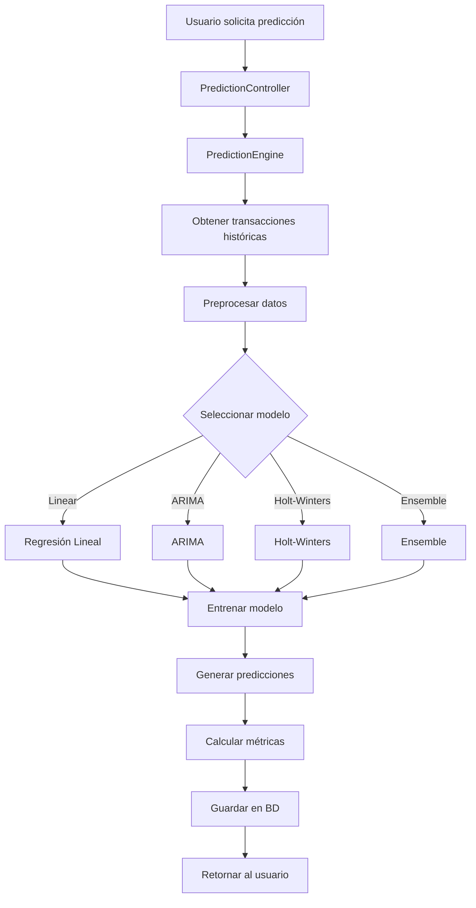

# Documentación: prediction.controller.ts

**Ubicación:** `src/controllers/prediction.controller.ts`

**Propósito:** Este archivo define el controlador de predicciones que maneja la generación de pronósticos financieros utilizando modelos de machine learning. Permite generar predicciones, obtener predicciones históricas y generar insights basados en análisis predictivo.

---

## Análisis Línea por Línea

### Líneas 1-3: Importaciones

```typescript
import { Request, Response } from 'express';
import { predictionEngine } from '../core/PredictionEngine';
import { Prediction } from '../models/Prediction.model';
```

#### Línea 1: Importación de tipos de Express
```typescript
import { Request, Response } from 'express';
```

**¿Qué hace?**
- Importa los tipos `Request` y `Response` de Express
- Proporciona tipado TypeScript para solicitudes y respuestas HTTP

---

#### Línea 2: Importación del motor de predicciones
```typescript
import { predictionEngine } from '../core/PredictionEngine';
```

**¿Qué hace?**
- Importa el motor de predicciones que contiene la lógica de machine learning
- **predictionEngine** es una instancia que maneja todos los modelos predictivos

**¿Qué es PredictionEngine?**
- Módulo core que implementa algoritmos de machine learning
- Contiene modelos como regresión lineal, ARIMA, Holt-Winters
- Procesa datos históricos para generar pronósticos

**Arquitectura de predicciones:**
```
Controlador (prediction.controller.ts)
    ↓
Motor de Predicciones (PredictionEngine.ts)
    ↓
Modelos ML (LinearRegression, ARIMA, etc.)
    ↓
Datos Históricos (Transacciones)
    ↓
Predicciones Generadas
```

**¿Qué hace el PredictionEngine?**
1. Obtiene transacciones históricas del usuario
2. Preprocesa los datos (limpieza, normalización)
3. Selecciona el modelo apropiado
4. Entrena el modelo con datos históricos
5. Genera predicciones para períodos futuros
6. Calcula métricas de confianza
7. Generar alertas con IA (Gemini)
8. Guarda la predicción en la base de datos

**Ejemplo de uso interno:**
```typescript
// En PredictionEngine.ts
class PredictionEngine {
  async predict(userId: string, modelType: string, periods: number) {
    // 1. Obtener datos históricos
    const transactions = await Transaction.find({ userId });
    
    // 2. Preprocesar datos
    const processedData = this.preprocessData(transactions);
    
    // 3. Seleccionar modelo
    const model = this.selectModel(modelType);
    
    // 4. Entrenar modelo
    model.train(processedData);
    
    // 5. Generar predicciones
    const predictions = model.predict(periods);
    
    // 6. Calcular métricas de confianza
    const metrics = model.getMetrics(); // Assuming getMetrics() returns metrics

    // 7. Generar alertas con IA (GeminiService)
    const aiAlerts = await geminiService.generateFinancialAlerts(processedData);

    // 8. Guardar en BD
    const savedPrediction = await Prediction.create({
      userId,
      modelType,
      periods,
      predictions,
      alerts: aiAlerts, // <-- Guardar alertas en la predicción
      metrics,
      generatedAt: new Date()
    });
    
    return savedPrediction;
  }
}
```

---

#### Línea 3: Importación del modelo Prediction
```typescript
import { Prediction } from '../models/Prediction.model';
```

**¿Qué hace?**
- Importa el modelo `Prediction` de Mongoose
- Representa la estructura de predicciones guardadas en MongoDB

**Estructura típica de una predicción:**
```typescript
interface IPrediction {
  _id: ObjectId;
  userId: ObjectId;
  modelType: 'linear' | 'arima' | 'holt-winters' | 'ensemble';
  periods: number;              // Número de períodos predichos
  predictions: Array<{
    period: string;             // Mes/período
    value: number;              // Valor predicho
    confidence: number;         // Nivel de confianza (0-1)
  }>;
  metrics: {
    mae: number;                // Mean Absolute Error
    rmse: number;               // Root Mean Square Error
    mape: number;               // Mean Absolute Percentage Error
  };
  generatedAt: Date;
  expiresAt: Date;
}
```

**Ejemplo de predicción guardada:**
```javascript
{
  userId: '507f191e810c19729de860ea',
  modelType: 'linear',
  periods: 6,
  predictions: [
    { period: '2025-12', value: 1500, confidence: 0.85 },
    { period: '2026-01', value: 1550, confidence: 0.82 },
    { period: '2026-02', value: 1600, confidence: 0.79 },
    { period: '2026-03', value: 1650, confidence: 0.76 },
    { period: '2026-04', value: 1700, confidence: 0.73 },
    { period: '2026-05', value: 1750, confidence: 0.70 }
  ],
  metrics: {
    mae: 75.5,
    rmse: 95.2,
    mape: 5.3
  },
  generatedAt: '2025-11-27T16:00:00.000Z'
}
```

---

### Línea 4: Línea en blanco
```typescript

```
**¿Qué hace?**
- Separa las importaciones de la definición de la clase

---

### Línea 5: Declaración de la clase
```typescript
export class PredictionController {
```

**¿Qué hace?**
- **`export class`**: Exporta la clase para uso en otros archivos
- **`PredictionController`**: Nombre de la clase
- Agrupa todos los métodos relacionados con predicciones

---

### Líneas 6-34: Método generatePrediction

```typescript
async generatePrediction(req: Request, res: Response): Promise<Response> {
```

#### Línea 6: Firma del método
**¿Qué hace?**
- **`async`**: Método asíncrono
- **`generatePrediction`**: Genera una nueva predicción
- **`Promise<Response>`**: Retorna una promesa que resuelve a Response

**¿Qué es generar una predicción?**
- Proceso de usar machine learning para pronosticar gastos/ingresos futuros
- Basado en patrones históricos de transacciones
- Proporciona estimaciones con niveles de confianza

---

#### Línea 7: Inicio del bloque try
```typescript
try {
```

**¿Qué hace?**
- Inicia el manejo de errores con try-catch

---

#### Líneas 8-9: Extracción de parámetros
```typescript
const userId = req.user?.id;
const { modelType, periods = 6 } = req.body;
```

**¿Qué hace?**
- **Línea 8**: Obtiene el ID del usuario autenticado
- **Línea 9**: Extrae parámetros del body
  - **`modelType`**: Tipo de modelo de ML a usar
  - **`periods = 6`**: Número de períodos a predecir (por defecto 6 meses)

**¿Qué es modelType?**
- Especifica qué algoritmo de machine learning usar
- Opciones típicas:
  - **`'linear'`**: Regresión lineal (simple, rápida)
  - **`'arima'`**: ARIMA (Auto-Regressive Integrated Moving Average)
  - **`'holt-winters'`**: Holt-Winters (para datos estacionales)
  - **`'ensemble'`**: Combinación de múltiples modelos

**Características de cada modelo:**

| Modelo | Complejidad | Precisión | Uso Ideal |
|--------|-------------|-----------|-----------|
| **Linear** | Baja | Media | Tendencias simples |
| **ARIMA** | Alta | Alta | Series temporales complejas |
| **Holt-Winters** | Media | Alta | Datos con estacionalidad |
| **Ensemble** | Muy Alta | Muy Alta | Máxima precisión |

**¿Qué son períodos?**
- Número de meses futuros a predecir
- Por defecto: 6 meses
- Rango típico: 1-24 meses

**Ejemplo de request:**
```json
POST /api/predictions/generate
Content-Type: application/json

{
  "modelType": "linear",
  "periods": 12
}
```

**¿Por qué del body y no de query?**
- POST es más apropiado para operaciones que crean recursos
- El body permite estructuras más complejas
- Semántica HTTP correcta para generación de datos

---

#### Línea 10: Línea en blanco
```typescript

```

---

#### Línea 11: Generación de la predicción
```typescript
const prediction = await predictionEngine.predict(userId!, modelType, periods);
```

**¿Qué hace?**
- **`predictionEngine.predict()`**: Llama al motor de predicciones
- **`userId!`**: ID del usuario (operador ! asegura que no es undefined)
- **`modelType`**: Tipo de modelo a usar
- **`periods`**: Número de períodos a predecir

**¿Qué hace predict() internamente?**

1. **Validación de datos:**
```typescript
// Verificar que hay suficientes datos históricos
if (transactions.length < 30) {
  throw new Error('Se requieren al menos 30 transacciones para generar predicciones');
}
```

2. **Preprocesamiento:**
```typescript
// Agrupar por mes, calcular totales
const monthlyData = this.aggregateByMonth(transactions);
// Normalizar datos
const normalized = this.normalize(monthlyData);
```

3. **Entrenamiento del modelo:**
```typescript
// Seleccionar modelo
const model = this.getModel(modelType);
// Entrenar con datos históricos
model.train(normalized);
```

4. **Generación de predicciones:**
```typescript
// Predecir N períodos futuros
const predictions = model.predict(periods);
```

5. **Cálculo de métricas:**
```typescript
// Calcular confianza y errores
const metrics = this.calculateMetrics(model, historicalData);
```

6. **Guardado en BD:**
```typescript
// Guardar predicción
const savedPrediction = await Prediction.create({
  userId,
  modelType,
  periods,
  predictions,
  metrics,
  generatedAt: new Date()
});
```

**Ejemplo de resultado:**
```javascript
{
  _id: '507f1f77bcf86cd799439015',
  userId: '507f191e810c19729de860ea',
  modelType: 'linear',
  periods: 6,
  predictions: [
    {
      period: '2025-12',
      value: 1500,
      confidence: 0.85,
      breakdown: {
        expenses: 1200,
        income: 2700
      }
    },
    // ... más períodos
  ],
  metrics: {
    mae: 75.5,
    rmse: 95.2,
    mape: 5.3
  },
  generatedAt: '2025-11-27T16:00:00.000Z'
}
```

---

#### Línea 12: Línea en blanco
```typescript

```

---

#### Líneas 13-17: Respuesta exitosa
```typescript
return res.status(200).json({
  success: true,
  message: 'Predicción generada exitosamente',
  data: prediction,
});
```

**¿Qué hace?**
- **`res.status(200)`**: Código 200 (OK)
- **`success: true`**: Indica éxito
- **`message`**: Mensaje descriptivo
- **`data: prediction`**: Predicción generada con todos sus datos

**Ejemplo de respuesta completa:**
```json
{
  "success": true,
  "message": "Predicción generada exitosamente",
  "data": {
    "_id": "507f1f77bcf86cd799439015",
    "userId": "507f191e810c19729de860ea",
    "modelType": "linear",
    "periods": 6,
    "predictions": [
      {
        "period": "2025-12",
        "value": 1500,
        "confidence": 0.85
      },
      {
        "period": "2026-01",
        "value": 1550,
        "confidence": 0.82
      }
    ],
    "metrics": {
      "mae": 75.5,
      "rmse": 95.2,
      "mape": 5.3
    },
    "generatedAt": "2025-11-27T16:00:00.000Z"
  }
}
```

**Uso en el frontend:**
```javascript
// Generar predicción
const response = await fetch('/api/predictions/generate', {
  method: 'POST',
  body: JSON.stringify({
    modelType: 'linear',
    periods: 6
  })
});

const { data } = await response.json();

// Mostrar gráfico de predicciones
renderPredictionChart(data.predictions);

// Mostrar métricas de confianza
showConfidence(data.metrics.mape);
```

---

#### Líneas 18-33: Manejo de errores
```typescript
} catch (error) {
  console.error('Error al generar predicción:', error);

  if (error instanceof Error && error.message.includes('al menos 30')) {
    return res.status(400).json({
      success: false,
      message: error.message,
    });
  }

  return res.status(500).json({
    success: false,
    message: 'Error al generar predicción',
    error: error instanceof Error ? error.message : 'Error desconocido',
  });
}
```

**¿Qué hace?**
- **Líneas 21-26**: Manejo específico de error de datos insuficientes
  - Verifica si el mensaje incluye "al menos 30"
  - Retorna 400 (Bad Request) con el mensaje específico
- **Líneas 28-32**: Manejo genérico de errores
  - Retorna 500 (Internal Server Error)

**¿Por qué verificar "al menos 30"?**
- El motor de predicciones requiere mínimo 30 transacciones
- Error específico que debe comunicarse al usuario
- 400 es más apropiado que 500 (es un problema de datos, no del servidor)

**Ejemplo de error de datos insuficientes:**
```json
{
  "success": false,
  "message": "Se requieren al menos 30 transacciones para generar predicciones confiables. Actualmente tienes 15."
}
```

**Otros errores posibles:**
- Error al entrenar el modelo
- Error al guardar en la base de datos
- Modelo no soportado
- Datos corruptos o inválidos

---

### Líneas 36-62: Método getPredictions

```typescript
async getPredictions(req: Request, res: Response): Promise<Response> {
```

#### Línea 36: Firma del método
**¿Qué hace?**
- Obtiene predicciones históricas del usuario
- Permite filtrar por tipo de modelo y limitar resultados

---

#### Líneas 38-39: Extracción de parámetros
```typescript
const userId = req.user?.id;
const { modelType, limit = 10 } = req.query;
```

**¿Qué hace?**
- **Línea 38**: Obtiene el ID del usuario
- **Línea 39**: Extrae parámetros de query
  - **`modelType`**: Filtro opcional por tipo de modelo
  - **`limit = 10`**: Número máximo de predicciones a retornar (por defecto 10)

**Ejemplo de URL:**
```
GET /api/predictions?modelType=linear&limit=5
```

Resulta en:
```javascript
modelType = 'linear'
limit = '5'  // String de la query
```

---

#### Líneas 41-42: Construcción del filtro
```typescript
const filter: any = { userId };
if (modelType) filter.modelType = modelType;
```

**¿Qué hace?**
- **Línea 41**: Crea filtro base con userId
- **Línea 42**: Agrega filtro de modelType si se proporcionó

**Ejemplos de filtro:**
```javascript
// Sin filtro de modelType
filter = { userId: '507f191e810c19729de860ea' }

// Con filtro de modelType
filter = {
  userId: '507f191e810c19729de860ea',
  modelType: 'linear'
}
```

---

#### Líneas 44-47: Consulta a la base de datos
```typescript
const predictions = await Prediction.find(filter)
  .sort({ generatedAt: -1 })
  .limit(Number(limit))
  .lean();
```

**¿Qué hace?**
- **`Prediction.find(filter)`**: Busca predicciones que coincidan con el filtro
- **`.sort({ generatedAt: -1 })`**: Ordena por fecha de generación descendente
  - `-1`: Más recientes primero
  - Las predicciones más nuevas aparecen primero
- **`.limit(Number(limit))`**: Limita el número de resultados
  - Convierte el string a número
  - Previene retornar demasiados datos
- **`.lean()`**: Retorna objetos JavaScript planos (optimización)

**¿Por qué ordenar por generatedAt descendente?**
- Las predicciones más recientes son más relevantes
- Los modelos mejoran con más datos
- Predicciones antiguas pueden estar desactualizadas

**Ejemplo de consulta:**
```javascript
// Últimas 5 predicciones lineales
const predictions = await Prediction.find({
  userId: '507f...',
  modelType: 'linear'
})
.sort({ generatedAt: -1 })
.limit(5)
.lean();

// Resultado: [pred_más_reciente, pred_2, pred_3, pred_4, pred_5]
```

---

#### Líneas 49-53: Respuesta exitosa
```typescript
return res.status(200).json({
  success: true,
  data: predictions,
  total: predictions.length,
});
```

**¿Qué hace?**
- Retorna las predicciones encontradas
- Incluye el total de predicciones retornadas

**Ejemplo de respuesta:**
```json
{
  "success": true,
  "data": [
    {
      "_id": "507f1f77bcf86cd799439015",
      "modelType": "linear",
      "periods": 6,
      "predictions": [...],
      "generatedAt": "2025-11-27T16:00:00.000Z"
    },
    {
      "_id": "507f1f77bcf86cd799439014",
      "modelType": "linear",
      "periods": 6,
      "predictions": [...],
      "generatedAt": "2025-11-26T10:00:00.000Z"
    }
  ],
  "total": 2
}
```

**Uso en el frontend:**
```javascript
// Obtener historial de predicciones
const response = await fetch('/api/predictions?limit=5');
const { data } = await response.json();

// Mostrar historial
data.forEach(prediction => {
  renderPredictionCard(prediction);
  showAccuracy(prediction.metrics);
});
```

---

### Líneas 66-84: Método getInsights

```typescript
async getInsights(req: Request, res: Response): Promise<Response> {
```

#### Línea 66: Firma del método
**¿Qué hace?**
- Genera insights (conocimientos) basados en análisis predictivo
- Proporciona recomendaciones y observaciones inteligentes

**¿Qué son insights?**
- Conocimientos accionables derivados de predicciones
- Análisis de tendencias y patrones
- Recomendaciones personalizadas
- Alertas sobre comportamientos financieros

**Ejemplos de insights:**
```javascript
{
  trends: {
    spending: 'increasing',
    savingsRate: 'decreasing',
    message: 'Tus gastos han aumentado 15% en los últimos 3 meses'
  },
  recommendations: [
    'Considera reducir gastos en categoría "Entretenimiento"',
    'Tu ahorro mensual está por debajo del objetivo'
  ],
  predictions: {
    nextMonth: {
      expectedExpenses: 1500,
      expectedIncome: 2500,
      projectedSavings: 1000
    }
  },
  alerts: [
    {
      type: 'warning',
      message: 'Se predice que excederás tu presupuesto en Diciembre'
    }
  ]
}
```

---

#### Línea 68: Obtención del userId
```typescript
const userId = req.user?.id;
```

**¿Qué hace?**
- Extrae el ID del usuario autenticado

---

#### Línea 70: Generación de insights
```typescript
const insights = await predictionEngine.generateInsights(userId!);
```

**¿Qué hace?**
- **`predictionEngine.generateInsights()`**: Llama al motor para generar insights
- Analiza predicciones y datos históricos para generar conocimientos

**¿Qué hace generateInsights() internamente?**

1. **Obtener predicciones recientes:**
```typescript
const latestPrediction = await Prediction.findOne({ userId })
  .sort({ generatedAt: -1 });
```

2. **Analizar tendencias:**
```typescript
const trends = this.analyzeTrends(historicalData, predictions);
// Identifica: aumentando, disminuyendo, estable
```

3. **Detectar anomalías:**
```typescript
const anomalies = this.detectAnomalies(historicalData);
// Gastos inusuales, picos, caídas
```

4. **Generar recomendaciones:**
```typescript
const recommendations = this.generateRecommendations(
  trends,
  anomalies,
  userGoals
);
```

5. **Calcular métricas clave:**
```typescript
const metrics = {
  savingsRate: calculateSavingsRate(),
  spendingVelocity: calculateSpendingVelocity(),
  budgetAdherence: calculateBudgetAdherence()
};
```

6. **Crear alertas predictivas:**
```typescript
const alerts = this.createPredictiveAlerts(predictions, budgets);
```

**Ejemplo de resultado:**
```javascript
{
  summary: {
    overallTrend: 'increasing_expenses',
    confidence: 0.85,
    period: 'last_3_months'
  },
  trends: {
    expenses: {
      direction: 'increasing',
      percentage: 15.5,
      categories: {
        'Comida': { change: 25, trend: 'up' },
        'Transporte': { change: -5, trend: 'down' }
      }
    },
    income: {
      direction: 'stable',
      percentage: 2.1
    }
  },
  predictions: {
    nextMonth: {
      totalExpenses: 1500,
      totalIncome: 2500,
      netSavings: 1000,
      confidence: 0.82
    },
    next3Months: {
      averageExpenses: 1550,
      trend: 'increasing'
    }
  },
  recommendations: [
    {
      type: 'budget',
      priority: 'high',
      message: 'Considera reducir gastos en "Comida" que han aumentado 25%',
      potentialSavings: 200
    },
    {
      type: 'savings',
      priority: 'medium',
      message: 'Aumenta tu ahorro mensual en $300 para alcanzar tu meta'
    }
  ],
  alerts: [
    {
      type: 'warning',
      severity: 'medium',
      message: 'Se predice que excederás tu presupuesto de Diciembre en $200'
    }
  ],
  opportunities: [
    {
      type: 'savings',
      message: 'Podrías ahorrar $150/mes optimizando gastos en "Entretenimiento"'
    }
  ]
}
```

---

#### Líneas 72-75: Respuesta exitosa
```typescript
return res.status(200).json({
  success: true,
  data: insights,
});
```

**¿Qué hace?**
- Retorna los insights generados

**Ejemplo de respuesta:**
```json
{
  "success": true,
  "data": {
    "summary": {
      "overallTrend": "increasing_expenses",
      "confidence": 0.85
    },
    "trends": {
      "expenses": {
        "direction": "increasing",
        "percentage": 15.5
      }
    },
    "recommendations": [
      {
        "type": "budget",
        "message": "Considera reducir gastos en Comida",
        "potentialSavings": 200
      }
    ],
    "alerts": [
      {
        "type": "warning",
        "message": "Excederás tu presupuesto en Diciembre"
      }
    ]
  }
}
```

**Uso en el frontend:**
```javascript
// Obtener insights
const response = await fetch('/api/predictions/insights');
const { data } = await response.json();

// Mostrar resumen
showTrendSummary(data.summary);

// Mostrar recomendaciones
data.recommendations.forEach(rec => {
  showRecommendation(rec);
});

// Mostrar alertas
data.alerts.forEach(alert => {
  showAlert(alert);
});
```

---

### Líneas 85-88: Exportación

```typescript
}

export const predictionController = new PredictionController();
```

#### Línea 85: Cierre de la clase
```typescript
}
```

**¿Qué hace?**
- Cierra la clase `PredictionController`

---

#### Línea 87: Creación y exportación de instancia
```typescript
export const predictionController = new PredictionController();
```

**¿Qué hace?**
- Crea una instancia de la clase
- Exporta la instancia (patrón Singleton)

**Uso en las rutas:**
```typescript
// En routes/prediction.routes.ts
import { predictionController } from '../controllers/prediction.controller';

router.post('/predictions/generate', authMiddleware, predictionController.generatePrediction);
router.get('/predictions', authMiddleware, predictionController.getPredictions);
router.get('/predictions/insights', authMiddleware, predictionController.getInsights);
```

---

## Resumen de Métodos

| Método | Ruta | Descripción | Retorna |
|--------|------|-------------|---------|
| `generatePrediction` | POST /predictions/generate | Genera nueva predicción con ML | Predicción con métricas |
| `getPredictions` | GET /predictions | Obtiene predicciones históricas | Array de predicciones |
| `getInsights` | GET /predictions/insights | Genera insights y recomendaciones | Análisis predictivo |

---

## Conceptos Clave

### 1. Modelos de Machine Learning

| Modelo | Algoritmo | Complejidad | Mejor Para |
|--------|-----------|-------------|------------|
| **Linear** | Regresión Lineal | Baja | Tendencias simples y lineales |
| **ARIMA** | AutoRegressive Integrated Moving Average | Alta | Series temporales complejas |
| **Holt-Winters** | Suavizado exponencial triple | Media | Datos con estacionalidad |
| **Ensemble** | Combinación de modelos | Muy Alta | Máxima precisión |

### 2. Métricas de Precisión

| Métrica | Descripción | Interpretación |
|---------|-------------|----------------|
| **MAE** | Mean Absolute Error | Error promedio en unidades absolutas |
| **RMSE** | Root Mean Square Error | Penaliza errores grandes más que MAE |
| **MAPE** | Mean Absolute Percentage Error | Error como porcentaje (más interpretable) |
| **Confidence** | Nivel de confianza | 0-1, donde 1 es máxima confianza |

**Ejemplo de interpretación:**
```javascript
metrics: {
  mae: 75.5,      // Error promedio de $75.50
  rmse: 95.2,     // Error cuadrático de $95.20
  mape: 5.3       // Error del 5.3%
}

// Interpretación: Las predicciones tienen un error promedio del 5.3%
// Si predice $1000, el valor real probablemente esté entre $947 y $1053
```

### 3. Tipos de Insights

| Tipo | Descripción | Ejemplo |
|------|-------------|---------|
| **Trends** | Tendencias en gastos/ingresos | "Gastos aumentando 15%" |
| **Recommendations** | Sugerencias accionables | "Reduce gastos en Comida" |
| **Alerts** | Advertencias predictivas | "Excederás presupuesto" |
| **Opportunities** | Oportunidades de ahorro | "Ahorra $150 optimizando" |

---

## Arquitectura de Predicciones



---

## Seguridad Implementada

✅ **Autenticación**: Todos los métodos requieren usuario autenticado  
✅ **Aislamiento de datos**: Usuarios solo ven sus propias predicciones  
✅ **Validación de datos**: Mínimo 30 transacciones requeridas  
✅ **Manejo de errores específicos**: 400 para datos insuficientes, 500 para errores del servidor  

---

## Mejores Prácticas Implementadas

✅ **Separación de responsabilidades**: Controlador delega lógica al PredictionEngine  
✅ **Valores por defecto**: periods=6, limit=10  
✅ **Ordenamiento lógico**: Predicciones más recientes primero  
✅ **Optimización**: Uso de `.lean()` para mejor performance  
✅ **Manejo de errores**: Try-catch con mensajes específicos  

---

## Posibles Mejoras

### 1. Validación de modelType
```typescript
const validModels = ['linear', 'arima', 'holt-winters', 'ensemble'];
if (modelType && !validModels.includes(modelType)) {
  return res.status(400).json({
    message: `Modelo inválido. Opciones: ${validModels.join(', ')}`
  });
}
```

### 2. Validación de períodos
```typescript
if (periods < 1 || periods > 24) {
  return res.status(400).json({
    message: 'Los períodos deben estar entre 1 y 24'
  });
}
```

### 3. Caché de predicciones
```typescript
// Cachear predicciones recientes
const cacheKey = `prediction:${userId}:${modelType}:${periods}`;
const cached = await redis.get(cacheKey);

if (cached) {
  return res.json(JSON.parse(cached));
}

const prediction = await predictionEngine.predict(userId, modelType, periods);
await redis.set(cacheKey, JSON.stringify(prediction), 'EX', 3600);
```

### 4. Paginación en getPredictions
```typescript
const { page = 1, limit = 10 } = req.query;
const skip = (Number(page) - 1) * Number(limit);

const predictions = await Prediction.find(filter)
  .sort({ generatedAt: -1 })
  .skip(skip)
  .limit(Number(limit));

const total = await Prediction.countDocuments(filter);
```

### 5. Comparación de modelos
```typescript
async compareModels(req: Request, res: Response) {
  const userId = req.user?.id;
  const { periods = 6 } = req.body;
  
  const models = ['linear', 'arima', 'holt-winters'];
  const predictions = await Promise.all(
    models.map(model => predictionEngine.predict(userId!, model, periods))
  );
  
  return res.json({
    success: true,
    data: predictions,
    recommendation: this.selectBestModel(predictions)
  });
}
```

### 6. Explicabilidad de predicciones
```typescript
// Agregar explicación de por qué se hizo la predicción
{
  prediction: 1500,
  explanation: {
    factors: [
      { factor: 'Tendencia histórica', impact: 60 },
      { factor: 'Estacionalidad', impact: 25 },
      { factor: 'Eventos recientes', impact: 15 }
    ],
    reasoning: 'La predicción se basa principalmente en tu patrón de gasto constante'
  }
}
```

---

## Casos de Uso

### 1. Generar Predicción
```javascript
// Usuario quiere ver predicción de próximos 6 meses
const response = await fetch('/api/predictions/generate', {
  method: 'POST',
  body: JSON.stringify({
    modelType: 'linear',
    periods: 6
  })
});

const { data } = await response.json();
renderPredictionChart(data.predictions);
```

### 2. Ver Historial de Predicciones
```javascript
// Ver últimas 5 predicciones
const response = await fetch('/api/predictions?limit=5');
const { data } = await response.json();

data.forEach(prediction => {
  showPredictionCard(prediction);
  showAccuracy(prediction.metrics.mape);
});
```

### 3. Obtener Insights Personalizados
```javascript
// Dashboard con insights
const response = await fetch('/api/predictions/insights');
const { data } = await response.json();

// Mostrar tendencias
showTrend(data.trends.expenses);

// Mostrar recomendaciones
data.recommendations.forEach(rec => {
  showRecommendation(rec);
});

// Mostrar alertas
if (data.alerts.length > 0) {
  showAlertBanner(data.alerts);
}
```

### 4. Comparar Precisión de Modelos
```javascript
// Generar con diferentes modelos y comparar
const models = ['linear', 'arima', 'holt-winters'];
const predictions = await Promise.all(
  models.map(model =>
    fetch('/api/predictions/generate', {
      method: 'POST',
      body: JSON.stringify({ modelType: model, periods: 6 })
    }).then(r => r.json())
  )
);

// Mostrar comparación
showModelComparison(predictions);
```
